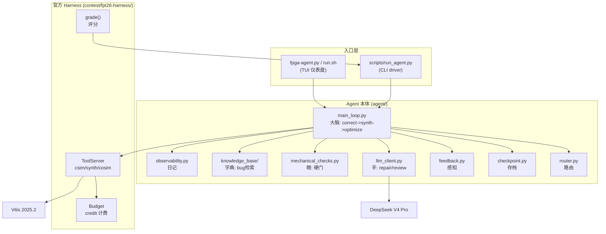

> [English](README.md)

# FPGA Agent - FPT'26 Track A LLM4HLS 备赛工程

> **一句话**：Budgeted End-to-End LLM4HLS Agent -- 在有限的工具调用预算内，自动修复并优化 AMD Vitis HLS 的 C/C++ 代码（先修正确性，再优化 PPA）。

FPGA Agent 是为 FPT'26 Design Competition Track A（LLM4HLS Agent）开发的参赛作品。它是一个自主 AI Agent，接收一道 HLS 题目，在 credit 预算内通过 csim/synth/cosim 工具反馈，借助 DeepSeek V4 Pro 诊断并修复代码，最终提交功能正确且 PPA 优化的方案。

---

## 目录

- [它能干什么](#它能干什么)
- [系统架构](#系统架构)
- [快速开始（Docker）](#快速开始docker)
- [配置 LLM（接入点 / 模型 ID / API Key）](#配置-llm接入点--模型-id--api-key)
- [运行 Agent](#运行-agent)
- [集成测试](#集成测试)
- [裸机部署（不用 Docker）](#裸机部署不用-docker)
- [仓库结构](#仓库结构)
- [输出怎么读](#输出怎么读)
- [当前状态与路线图](#当前状态与路线图)
- [已知限制与技术债](#已知限制与技术债)
- [常见问题](#常见问题)
- [文档与代码规范](#文档与代码规范)
- [分工](#分工)
- [许可证](#许可证)

---

## 它能干什么

一位 **Agent 开发者**，需要验证 agent 能否修通一道 HLS 题。他运行 `./run.sh`，在 TUI 选题界面选了 projection_bugfix，TUI 仪表盘实时显示 agent 的思考流、工具调用结果、credit 消耗。agent 自主诊断出 csim runtime_fail，让 DeepSeek 生成修复，机械检查 + LLM review 双层验证后重跑 csim，全过。最后评分卡显示 SCORE 1.400。全程不需要人工干预代码。

**核心能力**：
- 自动路由：读 task.toml，选关卡路径（repair->[csim]、structural->[csim,cosim]）
- 修复循环：csim 失败 -> LLM 诊断修复 -> 机械检查 + LLM review 双层验证 -> 重跑
- 存档择优：三规则（等级更高->存 / 同级比 latency / 更低->拒），提交最佳版本
- 可观测性：JSONL 结构化日志 + 心跳（卡死检测）+ TUI 实时仪表盘
- 评分对接：复用官方 harness 的 grade()，输出 PPA scorecard

---

## 系统架构



详细架构设计见 [`docs-development/design/agent-architecture.md`](docs-development/design/agent-architecture.md)（Mermaid 流程图 + 存档逻辑 + 可观测性）。

---

## 快速开始（Docker）

最快的上手方式。Docker 镜像包含 agent、官方评估 harness 和所有依赖。

### 前置条件

| 项目 | 要求 | 说明 |
|------|------|------|
| 操作系统 | Linux（Ubuntu 22.04 推荐） | 不支持 Windows |
| Docker | 已安装并运行 | `docker info` 应正常 |
| Vitis HLS 2025.2 | 需要（真运行） | 不打入镜像，运行时从宿主机挂载 |
| LLM API key | 需要（真 LLM 运行） | DeepSeek、Qwen 或任意 OpenAI 兼容端点 |

**不需要的东西**：GPU、数据库、消息队列、Web 服务器。

### 克隆和构建

```bash
git clone https://github.com/QFcattail/llm4hls.git fpga-agent
cd fpga-agent
git checkout open-source

# 构建 Docker 镜像（约 5-10 分钟）
docker build -t fpga-agent:latest .

# 验证构建
docker run --rm fpga-agent:latest --help
```

### 第一次运行

```bash
# Scripted 后端（不需要 API key，验证工具链）
./docker-run.sh contest/fpt26-harness/tasks/projection_bugfix

# 真 LLM 修复（需要 API key，见下节）
./docker-run.sh contest/fpt26-harness/tasks/projection_bugfix --backend deepseek
```

如果你的 Vitis 不在默认路径（`/home/admin/Xilinx/2025.2/Vitis`）：

```bash
VITIS_ROOT=/your/path/to/Vitis ./docker-run.sh contest/fpt26-harness/tasks/projection_bugfix
```

---

## 配置 LLM（接入点 / 模型 ID / API Key）

Agent 通过 **OpenAI 兼容 chat completions API** 与 LLM 通信。全部通过环境变量配置 -- 无需改代码。

### 环境变量一览

| 变量 | 必填 | 默认值 | 说明 |
|------|------|--------|------|
| `DEEPSEEK_API_KEY` | 是* | -- | DeepSeek API key |
| `LLM_API_KEY` | 是* | -- | 通用 API key（优先于 `DEEPSEEK_API_KEY`） |
| `LLM_BASE_URL` | 否 | `https://api.deepseek.com/v1/chat/completions` | 模型接入点 URL |
| `LLM_MODEL` | 否 | `deepseek-v4-pro` | 模型 ID |
| `LLM_THINKING` | 否 | `deepseek` | 思考模式：`deepseek` / `enable_thinking` / `none` |
| `LLM_TEMPERATURE` | 否 | `0.2` | 采样温度 |
| `LLM_TIMEOUT` | 否 | `300` | 请求超时（秒），大模型建议 `600` |
| `LLM_MAX_RETRIES` | 否 | `3` | 瞬时失败重试次数 |
| `VITIS_ROOT` | 否 | `/home/admin/Xilinx/2025.2/Vitis` | 宿主机 Vitis 安装路径 |

> \* `DEEPSEEK_API_KEY` 和 `LLM_API_KEY` 二选一。客户端先查 `LLM_API_KEY`，未设置则回退到 `DEEPSEEK_API_KEY`。

### 快速配置：`.env` 文件（推荐）

```bash
cp .env.example .env
# 编辑 .env，填入你的 key
nano .env
```

`docker-run.sh` 和 `run.sh` 会自动读取 `.env` 并将 key 传入容器。

### 各模型配置示例

**DeepSeek V4 Pro**（原生端点，最简配置）：

```bash
# .env
export DEEPSEEK_API_KEY=sk-your-deepseek-key-here
```

只需一个 key，其他都用默认值。

**Qwen3.5 122B**（阿里云 MaaS）：

```bash
# .env
export LLM_API_KEY=sk-your-aliyun-key
export LLM_BASE_URL=https://dashscope.aliyuncs.com/compatible-mode/v1/chat/completions
export LLM_MODEL=qwen3.5-122b-a10b
export LLM_THINKING=enable_thinking
export LLM_TIMEOUT=600
```

**Qwen3.6 27B**（阿里云 MaaS）：

```bash
# .env
export LLM_API_KEY=sk-your-aliyun-key
export LLM_BASE_URL=https://dashscope.aliyuncs.com/compatible-mode/v1/chat/completions
export LLM_MODEL=qwen3.6-27b
export LLM_THINKING=enable_thinking
```

**其他 OpenAI 兼容端点**（vLLM、Ollama、OpenRouter 等）：

```bash
# .env
export LLM_API_KEY=your-key-or-dummy
export LLM_BASE_URL=http://your-server:8000/v1/chat/completions
export LLM_MODEL=your-model-name
export LLM_THINKING=none
```

> `LLM_THINKING=none` 适用于不支持 `thinking` 字段的端点（某些 MaaS 网关会拒绝未知字段）。

完整文档模板见 [`.env.example`](.env.example)。

---

## 运行 Agent

### TUI 仪表盘（交互式）

TUI 实时显示 agent 的思考流、工具调用结果、credit/token 消耗和五阶段流程图。

```bash
# Docker
./docker-run.sh --tui contest/fpt26-harness/tasks/projection_bugfix --backend deepseek

# 裸机（自动 source Vitis + .env + venv）
./run.sh --task contest/fpt26-harness/tasks/projection_bugfix --backend deepseek
```

### CLI Driver（无 TUI，可脚本化）

```bash
# Docker
./docker-run.sh contest/fpt26-harness/tasks/projection_bugfix --backend deepseek

# 裸机
python3 scripts/run_agent.py contest/fpt26-harness/tasks/projection_bugfix --backend deepseek
```

### 常用命令

```bash
# 验证工具链（不花 token）
python3 scripts/run_agent.py contest/fpt26-harness/tasks/projection_bugfix

# 小预算测试
python3 scripts/run_agent.py contest/fpt26-harness/tasks/dotProduct_optimize --backend deepseek --budget 10

# token 节省模式（省 token，分数不降）
python3 scripts/run_agent.py contest/fpt26-harness/tasks/vecadd_optimize --backend deepseek --token-mode balanced

# 跑所有公开题
for t in projection_bugfix dotProduct_optimize residual_stream_deadlock; do
    python3 scripts/run_agent.py contest/fpt26-harness/tasks/$t --backend deepseek
done
```

### CLI 参数参考

```
python3 scripts/run_agent.py <task_dir> [options]

选项：
  --backend {scripted,deepseek,openrouter}   LLM 后端（默认 scripted）
  --budget N                                 覆盖 credit 预算
  --work DIR                                 工作目录（默认 runs/<task_id>）
  --force                                    无 Vitis 时强制运行（csim 会失败）
  --token-mode {full,balanced,aggressive}    token 节省模式（默认 full）
```

### 可用任务

```bash
ls contest/fpt26-harness/tasks/
# projection_bugfix   dotProduct_optimize   residual_stream_deadlock
# fir_optimize        matmul_optimize        vecadd_optimize
```

---

## 集成测试

### 离线链路测试（无 Vitis、无 API key）

```bash
python3 scripts/run_agent.py contest/fpt26-harness/tasks/projection_bugfix --force
```

预期：agent 运行，csim 返回 `compile_error`（无 Vitis），但链路结构被完整走通。

### 离线单元测试（无 Vitis、无 LLM）

19 个测试用例，mock 工具结果：

```bash
python3 scripts/test_main_loop.py
```

### Scripted 端到端（Vitis，无 API key）

使用 harness 的 `ScriptedClient`（回放参考答案）：

```bash
python3 scripts/run_agent.py contest/fpt26-harness/tasks/projection_bugfix
```

预期：SCORE 1.400。

### 真 LLM 冒烟测试（Vitis + API key）

最便宜的真 LLM 测试（约 5 credits、4k tokens）：

```bash
python3 scripts/run_agent.py contest/fpt26-harness/tasks/projection_bugfix --backend deepseek
```

预期：SCORE 1.400，credits 约 5/20。

### Docker 集成测试

```bash
docker build -t fpga-agent:latest .
./docker-run.sh contest/fpt26-harness/tasks/projection_bugfix
```

---

## 裸机部署（不用 Docker）

### 安装 Python 3.12

```bash
sudo add-apt-repository ppa:deadsnakes/ppa
sudo apt-get update && sudo apt-get install python3.12 python3.12-venv
python3.12 -m venv .venv && source .venv/bin/activate
pip install textual==0.86.2 rich==13.9.4
```

### 安装 Vitis 2025.2

```bash
source /opt/Xilinx/2025.2/Vitis/settings64.sh
export LLM4HLS_VITIS_HLS_ROOT=/opt/Xilinx/2025.2/Vitis
```

### 配置并运行

```bash
cp .env.example .env && nano .env  # 填入 key
source .env

# 运行
python3 scripts/run_agent.py contest/fpt26-harness/tasks/projection_bugfix --backend deepseek

# 或用便捷脚本（自动 source Vitis + .env + venv）
./run.sh --backend deepseek
```

---

## 仓库结构

```
fpga-agent/
├── docs-overview/        项目介绍、总体架构、术语表（所有人 first read）
├── docs-development/     需求、设计、工程计划、开发日志、评审、测试用例
│   ├── PROJECT-CONVENTIONS.md  工程规范总纲
│   ├── requirements/     需求分析
│   ├── design/           详细设计
│   ├── engineering-plan/ 工程计划（进度唯一真相来源）
│   ├── dev-log/          开发日志（按日期）
│   ├── reviews/          评审记录
│   ├── test-plan/        测试用例
│   └── notes/            ⚠️ 已移除（开源版不含）
├── agent/               Agent 本体代码（Python）
│   ├── README.md          ← 读代码从这里开始
│   ├── main_loop.py       主循环：correctness -> synth -> optimize
│   ├── router.py          路由器：task.toml -> 关卡路径
│   ├── checkpoint.py      存档逻辑：三规则
│   ├── feedback.py        反馈构建：ToolResult -> LLM 文本
│   ├── llm_client.py      LLM 调用：repair/review/propose_strategies
│   ├── mechanical_checks.py 硬性检查：签名/include
│   ├── deepseek_client.py DeepSeek V4 Pro API 对接
│   ├── observability.py   JSONL 日志 + 心跳
│   └── knowledge_base/    知识库（bug->修法检索）
├── tui/                 TUI 仪表盘（Textual + Rich）
├── scripts/             CLI 入口（run_agent.py）
├── contest/             官方评估 harness + 基准任务
│   ├── fpt26-harness/    官方 harness（Python + 基准 cpp/h/tb）
│   └── fpl26_reference/  FPL'26 参考源码
├── tools/               辅助脚本
├── runs/                运行产物（已 gitignore）
├── experiments/         实验数据归档
├── report/              竞赛报告（LaTeX）
├── fpga-agent.py        TUI 一行启动入口
├── run.sh               启动脚本（自动 source Vitis + .env + venv）
├── Dockerfile           Docker 镜像构建
├── docker-run.sh        Docker 运行脚本
├── .env.example         环境变量模板
├── LICENSE              MIT 许可证
├── NOTICE               第三方归属与许可证
└── .gitignore
```

每个顶层目录都有自己的 `README.md`。深入了解：

| 角色 | 入口文档 | 代码目录 |
|------|----------|----------|
| Agent 开发者 | [`agent/README.md`](agent/README.md) | `agent/` |
| TUI 开发者 | [`tui/README.md`](tui/README.md) | `tui/` |
| CLI 使用者 | [`scripts/README.md`](scripts/README.md) | `scripts/` |
| 项目概览 | [`docs-overview/README.md`](docs-overview/README.md) | -- |

---

## 输出怎么读

每次运行产出四块输出：

**① 运行日志（stderr，实时）**：
```
[log] route {'task_type': 'repair', 'correctness_stages': ['csim'], ...}
[log] tool_result {'kind': 'csim', 'phase': 'runtime_fail', 'credit_spent': 1}
[log] mechanical_review {'passed': True, 'issues': []}
[log] review {'verdict': 'pass', 'retry': 0}
[log] checkpoint {'old': 0, 'new': 1, 'reason': 'correctness_gate'}
```

**② Transcript（stdout，跑完打印）**：
```
--- metered tool transcript ---
  #1  [csim] runtime_fail (rc=1, 9.7s)   [spent 1/10]
  #2  [csim] pass (rc=0, 9.7s)          [spent 2/10]
  #3  [synth] pass (rc=0, 23.6s)        [spent 6/10]
  budget 6/10 credits spent (csimx2, synthx1)
```

**③ 评分卡（stdout，跑完打印）**：
```
=== Scorecard: projection_bugfix (difficulty 2) ===
  functional (hidden TB): PASS
  synthesizable         : PASS
  SCORE                 : 1.400
```

**④ JSONL 日志文件**（`runs/<task_id>/<task_id>.jsonl`）：结构化事件，事后用 `jq` 分析。详细日志阅读指南见 [`runs/README.md`](runs/README.md)。

---

## 当前状态与路线图

详见 [`docs-development/engineering-plan/engineering-plan.md`](docs-development/engineering-plan/engineering-plan.md)。

- **P0-P2 已完成**：基础设施、认知、骨架 + 最小正确性闭环。projection 题端到端真修复跑通（DeepSeek + 真 Vitis），SCORE 1.400。
- **P3-P4 已完成**：真 Vitis + cosim 验证（3/3 题全过）；PPA 优化实现（dotProduct 73.36 倍，SCORE 3.000）；Docker 打包验证通过；多模型评估完成（DeepSeek/Qwen3.5/Qwen3.6，18/18 正确性门全过）；报告 + TUI 截图交付。

---

## 已知限制与技术债

当前在册技术债：无（既有 TD-01~TD-04 已全部废弃/迁移）。

**已知限制**：
- 知识库检索在六道公开题上未被自然触发（正确性一次通过）
- 仅验证了 repair/structural/optimize 三种题型；`generate` 类型是未来工作
- 两个 Qwen 模型每（模型,任务）对仅单次运行（预算约束）

---

## 常见问题

### Q: 报错 "vitis-run not found"？

A: 没装 Vitis 或没 source `settings64.sh`。Docker 中确认 `VITIS_ROOT` 指向 Vitis 安装目录。裸机先 `source <vitis>/settings64.sh`。只想测框架链路可加 `--force`。

### Q: 报错 "API key missing"？

A: 设置 `DEEPSEEK_API_KEY` 或 `LLM_API_KEY`。从模板创建 `.env`：`cp .env.example .env`。

### Q: DeepSeek 返回空 content？

A: `deepseek-v4-pro` 是推理模型。保持 `max_tokens` 不设置（默认不限制）。设太小会让 reasoning 吃光预算。

### Q: 怎么切换到 Qwen 或其他模型？

A: 在 `.env` 中设置 `LLM_BASE_URL`、`LLM_MODEL`、`LLM_API_KEY` 和 `LLM_THINKING`（见上面的配置示例）。`--backend deepseek` 参数名虽然叫 deepseek，但实际用的是 `DeepSeekClient`，通过环境变量完全支持任意 OpenAI 兼容端点。

### Q: `--token-mode` 是什么？

A: 分级 token 节省开关。`full`（默认）= 不限制。`balanced` = 对廉价判定调用关闭 LLM 推理（省约 23% token，分数不降）。`aggressive` = 连策略提案也关闭推理（省约 75% 但可能降分）。

### Q: SCORE 是 0？

A: 检查：(1) csim 过了没？(2) hidden testbench 过了没？正确性不过直接 0 分。先确保 csim 过，再查 synth。

### Q: runs/ 目录在哪？

A: `docker-run.sh` 自动将宿主机的 `./runs/` 挂载到容器的 `/opt/fpga-agent/runs/`。运行产物直接出现在宿主机的 `runs/` 目录下，容器删除后依然保留。

---

## 文档与代码规范

详见 [`docs-development/PROJECT-CONVENTIONS.md`](docs-development/PROJECT-CONVENTIONS.md)。核心规则：

- 代码注释：**Google style** docstring，**必须全 ASCII 英文**。
- 每个代码文件配一份中英双语说明文档（`.doc.md`）。
- 面向外部用户的文档采用 `.md`（英文）+ `.cn.md`（中文）双文件，互相跳转。
- 内部过程文档（dev-log 等）以中文为主。
- **版本号每次重新构建/部署前必须 bump**（定义在 `agent/_version.py`）。

---

## 分工

| 姓名 | 角色 | 背景 | 负责 |
|---|---|---|---|
| **程千和** | Agent 主 | 机器人 / 大模型 Agent 落地经验 | `agent/`、`scripts/`、`tui/`、评估接口对接 |
| **方欣语** | HLS 域主 | 信息工程 / 射频芯片 | `agent/knowledge-base/`、本地题集、correctness/PPA 验证 |

---

## 技术栈

- **语言**：Python 3.11+（只用标准库，无第三方依赖；TUI 需 textual + rich）
- **LLM**：DeepSeek V4 Pro（推理模型，OpenAI 兼容 API）
- **EDA**：AMD Vitis 2025.2（`vitis-run --mode hls`）
- **目标硬件**：Alveo U55C `xcu55c-fsvh2892-2L-e` @ 200 MHz
- **Git**：`git@github.com:QFcattail/llm4hls.git`

---

## 许可证

本项目采用 **MIT** 许可证，详见 [`LICENSE`](LICENSE)。

- `agent/`、`tui/`、`scripts/`、`tools/` 目录下的代码为原创工作，版权归 Xinyu Fang 和 Qianhe Cheng 所有。
- `contest/fpt26-harness/` 是 FPT'26 竞赛官方提供的参考评估 harness，按竞赛要求原样复用，版权归竞赛组织方所有。
- 第三方依赖的归属与许可（textual、rich、IEEEtran 等）见 [`NOTICE`](NOTICE)。
