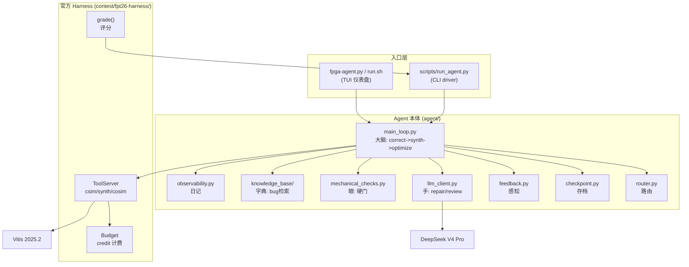

> [English](README.md)

# FPGA Agent - FPT'26 Track A LLM4HLS 备赛工程

> **一句话**：Budgeted End-to-End LLM4HLS Agent -- 在有限的工具调用预算内，自动修复并优化 AMD Vitis HLS 的 C/C++ 代码（先修正确性，再优化 PPA）。
>
> A budgeted, end-to-end LLM4HLS agent that automatically repairs and optimizes AMD Vitis HLS C/C++ code within a limited tool-call budget -- correctness first, PPA second.

FPGA Agent 是为 FPT'26 Design Competition Track A（LLM4HLS Agent）开发的参赛作品。它是一个自主 AI Agent，接收一道 HLS 题目，在 credit 预算内通过 csim/synth/cosim 工具反馈，借助 DeepSeek V4 Pro 诊断并修复代码，最终提交功能正确且 PPA 优化的方案。

---

## 目录

- [它能干什么](#它能干什么)
- [系统架构](#系统架构)
- [仓库结构](#仓库结构)
- [新手入门路线](#新手入门路线)
- [从源码构建](#从源码构建)
- [当前状态与路线图](#当前状态与路线图)
- [已知限制与技术债](#已知限制与技术债)
- [文档与代码规范](#文档与代码规范)

---

## 它能干什么

一位 **Agent 开发者**，需要验证 agent 能否修通一道 HLS 题。他运行 `./run.sh`，在 TUI 选题界面选了 projection_bugfix，TUI 仪表盘实时显示 agent 的思考流、工具调用结果、credit 消耗。agent 自主诊断出 csim runtime_fail，让 DeepSeek 生成修复，机械检查 + LLM review 双层验证后重跑 csim，全过。最后评分卡显示 SCORE 1.400。全程不需要人工干预代码。

**核心能力**：
- 自动路由：读 task.toml，选关卡路径（repair->[csim]、structural->[csim,cosim]）
- 修复循环：csim 失败 -> LLM 诊断修复 -> 机械检查 + LLM review 双层验证 -> 重跑
- 存档择优：三规则（等级更高->存 / 同级比 latency / 更低->拒），提交最佳版本
- 可观测性：JSONL 结构化日志 + 心跳（卡死检测）+ TUI 实时仪表盘
- 评分对接：复用官方 harness 的 grade()，输出 PPA scorecard

---

## 系统架构



详细架构设计见 [`docs-development/design/agent-architecture.md`](docs-development/design/agent-architecture.cn.md)（Mermaid 流程图 + 存档逻辑 + 可观测性）。

---

## 仓库结构

```
fpga-agent/
├── docs-overview/        项目介绍、总体架构、术语表（所有人 first read）
├── docs-development/     需求、设计、工程计划、开发日志、评审、测试用例、技术债
│   ├── PROJECT-CONVENTIONS.md  工程规范总纲
│   ├── runtime-constraints.md  ⚠️ 已移除（开源版不含；完整开发仓库有）
│   ├── requirements/     需求分析
│   ├── design/           详细设计
│   ├── engineering-plan/ 工程计划（进度唯一真相来源）
│   ├── dev-log/          开发日志（按日期）
│   ├── reviews/          评审记录
│   ├── test-plan/        测试用例
│   ├── internal-notes/   ⚠️ 已移除（开源版不含）
│   └── notes/            ⚠️ 已移除（开源版不含）
├── agent/               Agent 本体代码（Python）
│   ├── README.md          ← 读代码从这里开始
│   ├── main_loop.py       主循环：correctness -> synth -> optimize
│   ├── router.py          路由器：task.toml -> 关卡路径
│   ├── checkpoint.py      存档逻辑：三规则
│   ├── feedback.py        反馈构建：ToolResult -> LLM 文本
│   ├── llm_client.py      LLM 调用：repair/review/propose_strategies
│   ├── mechanical_checks.py 硬性检查：签名/include
│   ├── deepseek_client.py DeepSeek V4 Pro API 对接
│   ├── observability.py   JSONL 日志 + 心跳
│   ├── _version.py        版本号定义
│   ├── knowledge-base/    知识库 spec 文档（连字符）
│   └── knowledge_base/    知识库 Python 实现（下划线）
├── tui/                 TUI 仪表盘（Textual + Rich）
├── scripts/             CLI 入口（run_agent.py）
├── contest/             官方评估 harness + 基准任务（保留源码；规则/解读文档已移除）
│   ├── fpt26-harness/    官方评估 harness（Python + 基准 cpp/h/tb，agent 运行时依赖）
│   └── fpl26_reference/  FPL'26 参考源码（仅 .py + prompt，规则 md 已移除）
├── tools/               辅助脚本（web_fetch 等）
├── runs/                运行产物（已 gitignore）
├── fpga-agent.py        TUI 一行启动入口
├── run.sh               自动 source Vitis + .env + venv 的启动脚本
├── getting-started.md   快速入门指南（怎么装、怎么跑）
├── Dockerfile           Docker 镜像构建（详见 docker/README.md）
├── docker-run.sh        Docker 运行脚本
├── docker/README.md     Docker 详细说明（运行 agent、配置模型接入点/ID/key）
├── .env.example         环境变量模板（复制为 .env 后填写 API key）
├── LICENSE              MIT 许可证
├── NOTICE               第三方组件归属与许可证
└── .gitignore
```

每个顶层目录都有自己的 `README.md`，详细介绍该子系统的实现、构建、调用链。

---

## 新手入门路线

**第 1 步：理解项目要解决什么问题**

读 [`docs-overview/README.md`](docs-overview/README.cn.md) -- 项目背景、用户故事、总体架构图、术语表。

**第 2 步：怎么跑起来**

读 [`getting-started.md`](getting-started.cn.md) -- 5 分钟装好、跑通第一条命令、看懂 CLI 输出。

**第 3 步：理解各子系统怎么协作**

读本 README 的"系统架构"，然后读 [`docs-development/design/`](docs-development/design/) 下的设计文档。

**第 4 步：选一个子系统深入**

| 角色 | 入口文档 | 代码目录 |
|------|----------|----------|
| Agent 开发者 | [`agent/README.md`](agent/README.cn.md) | `agent/` |
| TUI 开发者 | [`tui/README.md`](tui/README.cn.md) | `tui/` |
| CLI 使用者 | [`scripts/README.md`](scripts/README.cn.md) | `scripts/` |
| 赛题研究者 | [`contest/README.md`](contest/README.md) | `contest/` |

**第 5 步：看进度和已知问题**

读 [`docs-development/engineering-plan/engineering-plan.md`](docs-development/engineering-plan/engineering-plan.md) 看项目进展。（技术债清单原在 `internal-notes/tech-debt.md`，已随开源版移除。）

**第 6 步：想看某天具体做了什么**

读 [`docs-development/dev-log/`](docs-development/dev-log/) 下按日期排列的开发日志。

---

## 从源码构建

### 前置环境

| 工具 | 版本 | 用于 |
|------|------|------|
| OS | Linux（Ubuntu 22.04 推荐）。Windows 不支持加速流 | 运行环境 |
| Python | 3.11+（需要 tomllib 标准库）。推荐 3.12 | agent + harness（纯标准库，无第三方依赖） |
| Vitis | 2025.2（仅真 csim/synth/cosim 需要；离线开发不需要） | HLS 工具链 |
| LLM API | DeepSeek V4 Pro（或 OpenRouter 开源模型） | LLM 修复 |

**不需要的东西**：GPU、数据库、消息队列、Web 服务器。

### 启动命令

| 方式 | 命令 | 产物 |
|--------|------|------|
| TUI 仪表盘（推荐） | `./run.sh` | 交互式选题 + 四区域仪表盘 |
| TUI 跳过选题 | `./run.sh --task contest/fpt26-harness/tasks/projection_bugfix` | 直接进仪表盘 |
| CLI driver（无 TUI） | `python3 scripts/run_agent.py <task_dir>` | 转录 + 评分卡 |
| 真 DeepSeek 端到端 | `./run.sh --backend deepseek` | 完整 LLM 修复（花 token） |
| 离线框架测试 | `python3 scripts/run_agent.py <task_dir> --force` | csim 会 compile_error，仅测链路 |

### 运行环境约束（必读）

部署前**必须**读 `docs-development/runtime-constraints.md`（在完整开发仓库中，开源版不含）-- 机器归属、Vitis 环境、赛题规则、credit 预算、评分公式等硬性约束。违反这些约束会导致卡死或返工。

---

## 当前状态与路线图

详细见 [`docs-development/engineering-plan/engineering-plan.md`](docs-development/engineering-plan/engineering-plan.md)。

- **P0 已完成**：基础设施搭建（仓库、目录、文档中心）。
- **P1 已完成**：认知 + 环境（背景资料、harness 解压、离线链路、架构定稿）。
- **P2 里程碑达成**：搭骨架 + 最小正确性闭环。projection 题端到端真修复跑通（DeepSeek + 真 Vitis），SCORE 1.400。
- **P3 待开始**：接真 Vitis + cosim + 里程碑（扩 structural 路径，端到端跑 milestone）。
- **P4 待开始**：PPA 优化冲分 + 提交物（optimize 阶段 + token 优化 + Docker/报告/视频）。

---

## 已知限制与技术债

完整技术债清单原在 `docs-development/internal-notes/tech-debt.md`，已随开源版移除。

当前在册技术债：无（既有 TD-01~TD-04 已全部废弃/迁移）。开发过程中发现的问题会及时登记。

**已知限制**：
- 知识库条目为空（待 P2-12 方欣语填充 >=10 条）
- optimize 阶段为 stub（P4 实现）
- 仅在 projection 题上验证过端到端（dotProduct/residual 待验证）

---

## 文档与代码规范

详见 [`docs-development/PROJECT-CONVENTIONS.md`](docs-development/PROJECT-CONVENTIONS.md)。核心规则：

- 代码注释：**Google style** docstring（`Args:`/`Returns:`/`Attributes:` 段落式），**必须全 ASCII 英文**。
- 每个代码文件配一份中英双语说明文档（`.doc.md`）。
- 项目管理文档以中文为主，关键术语辅以英文。
- **版本号每次重新构建/部署前必须 bump**，TUI 界面必须显示版本号（定义在 `agent/_version.py`）。

---

## 分工

| 姓名 | 角色 | 背景 | 负责 |
|---|---|---|---|
| **程千和** | 程千和 | 机器人 / 大模型 Agent 落地经验 | `agent/`、`scripts/`、`tui/`、评估接口对接 |
| **方欣语** | 方欣语 | 信息工程 / 射频芯片 | `agent/knowledge-base/`、本地题集、correctness/PPA 验证 |

---

## 技术栈

- **语言**：Python 3.11+（只用标准库，无第三方依赖；TUI 需 textual + rich）
- **LLM**：DeepSeek V4 Pro（推理模型，OpenAI 兼容 API）
- **EDA**：AMD Vitis 2025.2（`vitis-run --mode hls`）
- **目标硬件**：Alveo U55C `xcu55c-fsvh2892-2L-e` @ 200 MHz
- **Git**：`git@gitee.com:QFcattail/fpga-agent.git`

---

## 许可证

本项目采用 **MIT** 许可证，详见 [`LICENSE`](LICENSE)。

- `agent/`、`tui/`、`scripts/`、`tools/` 目录下的代码为原创工作，版权归 Xinyu Fang 和 Qianhe Cheng 所有。
- `contest/fpt26-harness/` 是 FPT'26 竞赛官方提供的参考评估 harness（Python 源码 + 基准任务），按竞赛要求原样复用，版权归竞赛组织方所有。竞赛规则/解读文档（docx/html/jpg/md）已从开源版本中移除。
- `contest/fpl26_reference/` 保留参考源码（.py），规则解读 md 已移除。
- `docs-development/notes/` 和 `docs-development/internal-notes/`（外部论文摘要、备赛学习手册等内部资料）已从开源版本中移除。
- 第三方依赖（textual、rich、IEEEtran 等）的归属与许可见 [`NOTICE`](NOTICE)。
