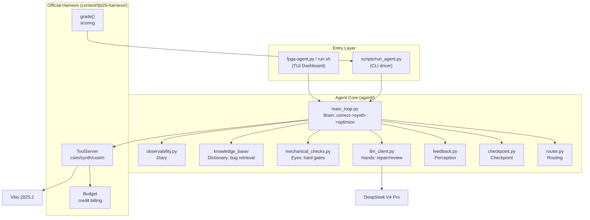

> [中文](README.cn.md)

# FPGA Agent - FPT'26 Track A LLM4HLS Competition Project

> **In one sentence**: A budgeted, end-to-end LLM4HLS agent that automatically repairs and optimizes AMD Vitis HLS C/C++ code within a limited tool-call budget -- correctness first, PPA second.

FPGA Agent is a competition submission for the FPT'26 Design Competition Track A (LLM4HLS Agent). It is an autonomous AI agent that receives an HLS task, diagnoses and repairs code via csim/synth/cosim tool feedback within a credit budget using DeepSeek V4 Pro, and ultimately submits a functionally correct and PPA-optimized solution.

---

## Table of Contents

- [What It Does](#what-it-does)
- [System Architecture](#system-architecture)
- [Repository Structure](#repository-structure)
- [Onboarding Path](#onboarding-path)
- [Build from Source](#build-from-source)
- [Current Status and Roadmap](#current-status-and-roadmap)
- [Known Limitations and Tech Debt](#known-limitations-and-tech-debt)
- [Documentation and Code Conventions](#documentation-and-code-conventions)

---

## What It Does

An **Agent Developer** wants to verify that the agent can solve an HLS task. They run `./run.sh`, select `projection_bugfix` in the TUI task picker, and the TUI dashboard shows the agent's reasoning stream, tool-call results, and credit consumption in real time. The agent autonomously diagnoses a csim runtime_fail, asks DeepSeek to generate a fix, passes dual-gate verification (mechanical check + LLM review), re-runs csim, and passes. The final scorecard shows SCORE 1.400. No manual code intervention is needed.

**Core capabilities**:
- Auto-routing: reads task.toml, selects the stage path (repair->[csim], structural->[csim,cosim])
- Repair loop: csim fail -> LLM diagnosis & fix -> mechanical check + LLM review dual-gate -> retry
- Checkpoint arbitration: three rules (level-up -> accept / same-level -> lower latency wins / level-down -> reject), submits the best version
- Observability: JSONL structured logs + heartbeat (stall detection) + real-time TUI dashboard
- Scoring: reuses the official harness grade(), outputs a PPA scorecard

---

## System Architecture



Detailed architecture design in [`docs-development/design/agent-architecture.md`](docs-development/design/agent-architecture.md) (Mermaid flowcharts + checkpoint logic + observability).

---

## Repository Structure

```
fpga-agent/
├── docs-overview/        Project intro, overall architecture, glossary (read first)
├── docs-development/     Requirements, design, engineering plan, dev logs, reviews, test cases, tech debt
│   ├── PROJECT-CONVENTIONS.md  Engineering conventions master document
│   ├── runtime-constraints.md  (removed in open-source; internal-only runtime constraints)
│   ├── requirements/     Requirements analysis
│   ├── design/           Detailed design
│   ├── engineering-plan/ Engineering plan (single source of truth for progress)
│   ├── dev-log/          Development logs (by date)
│   ├── reviews/          Review records
│   ├── test-plan/        Test cases
│   └── notes/            (removed in open-source release)
├── agent/               Agent core code (Python)
│   ├── README.md          ← Start reading code here
│   ├── main_loop.py       Main loop: correctness -> synth -> optimize
│   ├── router.py          Router: task.toml -> stage path
│   ├── checkpoint.py      Checkpoint logic: three rules
│   ├── feedback.py        Feedback construction: ToolResult -> LLM text
│   ├── llm_client.py      LLM calls: repair/review/propose_strategies
│   ├── mechanical_checks.py Hard checks: signature/include
│   ├── deepseek_client.py DeepSeek V4 Pro API client
│   ├── observability.py   JSONL logging + heartbeat
│   ├── _version.py        Version number definition
│   ├── knowledge-base/    Knowledge base spec docs (hyphenated)
│   └── knowledge_base/    Knowledge base Python implementation (underscored)
├── tui/                 TUI dashboard (Textual + Rich)
├── scripts/             CLI entry point (run_agent.py)
├── contest/             Official evaluation harness + benchmark tasks (source retained; rule docs removed)
│   ├── fpt26-harness/    Official evaluation harness (Python + benchmark cpp/h/tb, agent runtime dependency)
│   └── fpl26_reference/  FPL'26 reference source code (.py only; rule md removed)
├── tools/               Helper scripts (web_fetch etc.)
├── runs/                Run outputs (gitignored)
├── fpga-agent.py        TUI one-line entry point
├── run.sh               Startup script (auto-source Vitis + .env + venv)
├── getting-started.md   Quick start guide (how to install, how to run)
├── Dockerfile           Docker image build (see docker/README.md)
├── docker-run.sh        Docker run script
├── docker/README.md     Detailed Docker guide (running agent, configuring model endpoint/ID/key)
├── .env.example         Environment variable template (copy to .env, fill in API key)
├── LICENSE              MIT License
├── NOTICE               Third-party component attributions and licenses
└── .gitignore
```

Each top-level directory has its own `README.md` with detailed information about that subsystem.

---

## Onboarding Path

**Step 1: Understand what problem the project solves**

Read [`docs-overview/README.md`](docs-overview/README.md) -- project background, user stories, overall architecture diagram, glossary.

**Step 2: How to run it**

Read [`getting-started.md`](getting-started.md) -- 5-minute setup, run the first command, understand CLI output.

**Step 3: Understand how subsystems cooperate**

Read the "System Architecture" section of this README, then read [`docs-development/design/`](docs-development/design/).

**Step 4: Dive into a subsystem**

| Role | Entry Document | Code Directory |
|------|----------------|----------------|
| Agent Developer | [`agent/README.md`](agent/README.md) | `agent/` |
| TUI Developer | [`tui/README.md`](tui/README.md) | `tui/` |
| CLI User | [`scripts/README.md`](scripts/README.md) | `scripts/` |
| Contest Researcher | [`contest/README.md`](contest/README.md) | `contest/` |

**Step 5: Check progress and known issues**

Read [`docs-development/engineering-plan/engineering-plan.md`](docs-development/engineering-plan/engineering-plan.md) for project progress. (The tech-debt list was in `internal-notes/tech-debt.md`, removed in the open-source release.)

**Step 6: See what happened on a specific day**

Read [`docs-development/dev-log/`](docs-development/dev-log/) for development logs sorted by date.

---

## Build from Source

### Prerequisites

| Tool | Version | Used For |
|------|---------|----------|
| OS | Linux (Ubuntu 22.04 recommended). Windows does not support accelerated flows | Runtime environment |
| Python | 3.11+ (requires tomllib stdlib). 3.12 recommended | agent + harness (pure stdlib, no third-party deps) |
| Vitis | 2025.2 (only needed for real csim/synth/cosim; not needed for offline dev) | HLS toolchain |
| LLM API | DeepSeek V4 Pro (or OpenRouter open-source models) | LLM repair |

**Not needed**: GPU, database, message queue, web server.

### Startup Commands

| Method | Command | Output |
|--------|---------|--------|
| TUI dashboard (recommended) | `./run.sh` | Interactive task picker + four-zone dashboard |
| TUI skip picker | `./run.sh --task contest/fpt26-harness/tasks/projection_bugfix` | Direct dashboard |
| CLI driver (no TUI) | `python3 scripts/run_agent.py <task_dir>` | Transcript + scorecard |
| Real DeepSeek end-to-end | `./run.sh --backend deepseek` | Full LLM repair (costs tokens) |
| Offline framework test | `python3 scripts/run_agent.py <task_dir> --force` | csim will compile_error, tests the pipeline only |

### Runtime Constraints (Must Read)

Before deploying, **must** read `docs-development/runtime-constraints.md` (available in the full development repo, not included in this open-source release) -- machine ownership, Vitis environment, contest rules, credit budget, scoring formula, and other hard constraints. Violating these constraints causes stalls or rework.

---

## Current Status and Roadmap

See [`docs-development/engineering-plan/engineering-plan.md`](docs-development/engineering-plan/engineering-plan.md) for details.

- **P0 Complete**: Infrastructure setup (repo, directories, documentation hub).
- **P1 Complete**: Cognition + environment (background materials, harness extraction, offline pipeline, architecture finalized).
- **P2 Milestone reached**: Skeleton + minimal correctness loop. projection task end-to-end real repair passed (DeepSeek + real Vitis), SCORE 1.400.
- **P3 Not started**: Real Vitis + cosim + milestones (expand structural path, end-to-end milestone run).
- **P4 Not started**: PPA optimization scoring + deliverables (optimize stage + token optimization + Docker/report/video).

---

## Known Limitations and Tech Debt

The full tech-debt list was in `docs-development/internal-notes/tech-debt.md`, removed in the open-source release.

Currently registered tech debt: none (existing TD-01~TD-04 all deprecated/migrated). Issues found during development are logged promptly.

**Known limitations**:
- Knowledge base entries empty (P2-12 HLS domain owner to fill >=10 entries)
- Optimize stage is a stub (P4 implementation)
- End-to-end only verified on the projection task (dotProduct/residual pending)

---

## Documentation and Code Conventions

See [`docs-development/PROJECT-CONVENTIONS.md`](docs-development/PROJECT-CONVENTIONS.md). Core rules:

- Code comments: **Google style** docstring (`Args:`/`Returns:`/`Attributes:` block style), **must be all ASCII English**.
- Each code file has a companion bilingual doc (`.doc.md`).
- External-facing documents use `.md` (English) + `.cn.md` (Chinese) dual files with cross-links.
- Internal process documents (dev-log etc.) are primarily Chinese with English terms.
- **Version number must be bumped before every rebuild/deploy**, and the TUI must display the version (defined in `agent/_version.py`).

---

## Division of Labor

| Name | Role | Background | Responsible For |
|---|---|---|---|
| **Qianhe Cheng** | Agent Lead | Robotics / LLM Agent experience | `agent/`, `scripts/`, `tui/`, evaluation interface integration |
| **Xinyu Fang** | HLS Domain Owner | Information Engineering / RF chips | `agent/knowledge-base/`, local task set, correctness/PPA validation |

---

## Tech Stack

- **Language**: Python 3.11+ (stdlib only, no third-party deps; TUI requires textual + rich)
- **LLM**: DeepSeek V4 Pro (reasoning model, OpenAI-compatible API)
- **EDA**: AMD Vitis 2025.2 (`vitis-run --mode hls`)
- **Target hardware**: Alveo U55C `xcu55c-fsvh2892-2L-e` @ 200 MHz
- **Git**: `git@github.com:QFcattail/llm4hls.git`

---

## License

This project is licensed under the **MIT** license; see [`LICENSE`](LICENSE).

- Code in `agent/`, `tui/`, `scripts/`, `tools/` is original work, copyright Xinyu Fang and Qianhe Cheng.
- `contest/fpt26-harness/` is the official FPT'26 competition evaluation harness, reused verbatim per competition requirements; copyright belongs to the competition organizers. Rule/interpretation docs (docx/html/jpg/md) have been removed from the open-source version.
- `contest/fpl26_reference/` retains reference source code (.py); rule interpretation md files have been removed.
- `docs-development/notes/` and `docs-development/internal-notes/` (external paper abstracts, study handbooks, etc.) have been removed from the open-source version.
- Third-party dependency attributions and licenses (textual, rich, IEEEtran, etc.) are in [`NOTICE`](NOTICE).
