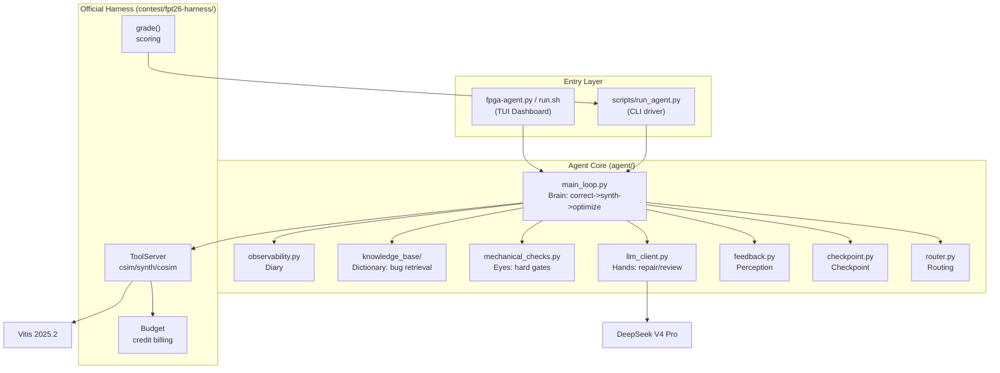

> [中文](README.cn.md)

# FPGA Agent - FPT'26 Track A LLM4HLS Competition Project

> **In one sentence**: A budgeted, end-to-end LLM4HLS agent that automatically repairs and optimizes AMD Vitis HLS C/C++ code within a limited tool-call budget -- correctness first, PPA second.

FPGA Agent is a competition submission for the FPT'26 Design Competition Track A (LLM4HLS Agent). It is an autonomous AI agent that receives an HLS task, diagnoses and repairs code via csim/synth/cosim tool feedback within a credit budget using DeepSeek V4 Pro, and ultimately submits a functionally correct and PPA-optimized solution.

---

## Table of Contents

- [What It Does](#what-it-does)
- [System Architecture](#system-architecture)
- [Quick Start (Docker)](#quick-start-docker)
- [Configuring Your LLM (Endpoint / Model ID / API Key)](#configuring-your-llm-endpoint--model-id--api-key)
- [Running the Agent](#running-the-agent)
- [Integration Testing](#integration-testing)
- [Bare-Metal Setup (no Docker)](#bare-metal-setup-no-docker)
- [Repository Structure](#repository-structure)
- [How to Read the Output](#how-to-read-the-output)
- [Current Status and Roadmap](#current-status-and-roadmap)
- [Known Limitations and Tech Debt](#known-limitations-and-tech-debt)
- [FAQ](#faq)
- [Documentation and Code Conventions](#documentation-and-code-conventions)
- [Division of Labor](#division-of-labor)
- [License](#license)

---

## What It Does

An **Agent Developer** wants to verify that the agent can solve an HLS task. They run `./run.sh`, select `projection_bugfix` in the TUI task picker, and the TUI dashboard shows the agent's reasoning stream, tool-call results, and credit consumption in real time. The agent autonomously diagnoses a csim runtime_fail, asks DeepSeek to generate a fix, passes dual-gate verification (mechanical check + LLM review), re-runs csim, and passes. The final scorecard shows SCORE 1.400. No manual code intervention is needed.

**Core capabilities**:
- Auto-routing: reads task.toml, selects the stage path (repair->[csim], structural->[csim,cosim])
- Repair loop: csim fail -> LLM diagnosis & fix -> mechanical check + LLM review dual-gate -> retry
- Checkpoint arbitration: three rules (level-up -> accept / same-level -> lower latency wins / level-down -> reject), submits the best version
- Observability: JSONL structured logs + heartbeat (stall detection) + real-time TUI dashboard
- Scoring: reuses the official harness grade(), outputs a PPA scorecard

---

## System Architecture



Detailed architecture design in [`docs-development/design/agent-architecture.md`](docs-development/design/agent-architecture.md) (Mermaid flowcharts + checkpoint logic + observability).

---

## Quick Start (Docker)

The fastest way to get running. The Docker image contains the agent, the official evaluation harness, and all dependencies.

### Prerequisites

| Item | Required | Notes |
|------|----------|-------|
| OS | Linux (Ubuntu 22.04 recommended) | Windows is not supported |
| Docker | Yes | `docker info` should succeed |
| Vitis HLS 2025.2 | Yes (for real runs) | Not baked into the Docker image; bind-mounted from the host |
| LLM API key | Yes (for real LLM runs) | DeepSeek, Qwen, or any OpenAI-compatible endpoint |

**You do NOT need**: GPU, database, message queue, web server.

### Clone and build

```bash
git clone https://github.com/QFcattail/llm4hls.git fpga-agent
cd fpga-agent
git checkout open-source

# Build the Docker image (~5-10 min)
docker build -t fpga-agent:latest .

# Verify the build
docker run --rm fpga-agent:latest --help
```

### First run

```bash
# Scripted backend (no API key needed, verifies the pipeline)
./docker-run.sh contest/fpt26-harness/tasks/projection_bugfix

# Real LLM repair (needs API key, see next section)
./docker-run.sh contest/fpt26-harness/tasks/projection_bugfix --backend deepseek
```

If your Vitis is not at the default path (`/home/admin/Xilinx/2025.2/Vitis`):

```bash
VITIS_ROOT=/your/path/to/Vitis ./docker-run.sh contest/fpt26-harness/tasks/projection_bugfix
```

---

## Configuring Your LLM (Endpoint / Model ID / API Key)

The agent talks to LLMs via an **OpenAI-compatible chat completions API**. You configure it entirely through environment variables -- no code changes needed.

### Environment variables at a glance

| Variable | Required | Default | Description |
|----------|----------|---------|-------------|
| `DEEPSEEK_API_KEY` | Yes* | -- | API key for DeepSeek |
| `LLM_API_KEY` | Yes* | -- | Generic API key (checked before `DEEPSEEK_API_KEY`) |
| `LLM_BASE_URL` | No | `https://api.deepseek.com/v1/chat/completions` | Chat completions endpoint URL |
| `LLM_MODEL` | No | `deepseek-v4-pro` | Model identifier |
| `LLM_THINKING` | No | `deepseek` | Thinking mode: `deepseek` / `enable_thinking` / `none` |
| `LLM_TEMPERATURE` | No | `0.2` | Sampling temperature |
| `LLM_TIMEOUT` | No | `300` | Request timeout in seconds (use `600` for 100B+ models) |
| `LLM_MAX_RETRIES` | No | `3` | Retries on transient failure |
| `VITIS_ROOT` | No | `/home/admin/Xilinx/2025.2/Vitis` | Host Vitis install path |

> \* Set either `DEEPSEEK_API_KEY` or `LLM_API_KEY`. The client checks `LLM_API_KEY` first, then falls back to `DEEPSEEK_API_KEY`.

### Quick config: interactive setup (recommended)

```bash
# Interactive CLI: choose provider, enter key, done
python3 scripts/setup_env.py

# Validate configuration + test API connectivity
python3 scripts/check_env.py --test-api
```

Or create `.env` manually:

```bash
cp .env.example .env
# Edit .env with your key
nano .env
```

`docker-run.sh` and `run.sh` automatically read `.env` and pass the key into the container.

### Configuration recipes by provider

**DeepSeek V4 Pro** (native endpoint -- simplest):

```bash
# .env
export DEEPSEEK_API_KEY=sk-your-deepseek-key-here
```

That's it. The endpoint and model ID default to DeepSeek's values.

**Qwen3.5 122B** via Aliyun MaaS:

```bash
# .env
export LLM_API_KEY=sk-your-aliyun-key
export LLM_BASE_URL=https://dashscope.aliyuncs.com/compatible-mode/v1/chat/completions
export LLM_MODEL=qwen3.5-122b-a10b
export LLM_THINKING=enable_thinking
export LLM_TIMEOUT=600
```

**Qwen3.6 27B** via Aliyun MaaS:

```bash
# .env
export LLM_API_KEY=sk-your-aliyun-key
export LLM_BASE_URL=https://dashscope.aliyuncs.com/compatible-mode/v1/chat/completions
export LLM_MODEL=qwen3.6-27b
export LLM_THINKING=enable_thinking
```

**Any OpenAI-compatible endpoint** (vLLM, Ollama, OpenRouter, etc.):

```bash
# .env
export LLM_API_KEY=your-key-or-dummy
export LLM_BASE_URL=http://your-server:8000/v1/chat/completions
export LLM_MODEL=your-model-name
export LLM_THINKING=none
```

> `LLM_THINKING=none` is for endpoints that reject the `thinking` field (some MaaS gateways).

See [`.env.example`](.env.example) for a fully documented template.

---

## Running the Agent

### TUI Dashboard (interactive)

The TUI shows the agent's reasoning stream, tool-call results, credit/token consumption, and a five-stage flow chart in real time.

```bash
# Docker
./docker-run.sh --tui contest/fpt26-harness/tasks/projection_bugfix --backend deepseek

# Bare metal (auto-sources Vitis + .env + venv)
./run.sh --task contest/fpt26-harness/tasks/projection_bugfix --backend deepseek
```

### CLI Driver (no TUI, scriptable)

```bash
# Docker
./docker-run.sh contest/fpt26-harness/tasks/projection_bugfix --backend deepseek

# Bare metal
python3 scripts/run_agent.py contest/fpt26-harness/tasks/projection_bugfix --backend deepseek
```

### Common commands

```bash
# Verify the toolchain (no tokens spent)
python3 scripts/run_agent.py contest/fpt26-harness/tasks/projection_bugfix

# Small budget test
python3 scripts/run_agent.py contest/fpt26-harness/tasks/dotProduct_optimize --backend deepseek --budget 10

# Token-saving mode (fewer tokens, same score)
python3 scripts/run_agent.py contest/fpt26-harness/tasks/vecadd_optimize --backend deepseek --token-mode balanced

# Run all public tasks
for t in projection_bugfix dotProduct_optimize residual_stream_deadlock; do
    python3 scripts/run_agent.py contest/fpt26-harness/tasks/$t --backend deepseek
done
```

### CLI options reference

```
python3 scripts/run_agent.py <task_dir> [options]

Options:
  --backend {scripted,deepseek,openrouter}   LLM backend (default: scripted)
  --budget N                                 Override credit budget
  --work DIR                                 Working directory (default: runs/<task_id>)
  --force                                    Run without Vitis (csim will fail)
  --token-mode {full,balanced,aggressive}    Token-saving level (default: full)
```

### Available tasks

```bash
ls contest/fpt26-harness/tasks/
# projection_bugfix   dotProduct_optimize   residual_stream_deadlock
# fir_optimize        matmul_optimize        vecadd_optimize
```

---

## Integration Testing

### Offline pipeline test (no Vitis, no API key)

```bash
python3 scripts/run_agent.py contest/fpt26-harness/tasks/projection_bugfix --force
```

Expected: the agent runs, csim returns `compile_error` (no Vitis), but the pipeline structure is exercised.

### Offline unit tests (no Vitis, no LLM)

19 test cases with mocked tool results:

```bash
python3 scripts/test_main_loop.py
```

### Scripted end-to-end (Vitis, no API key)

Uses the harness's `ScriptedClient` (replays the reference solution):

```bash
python3 scripts/run_agent.py contest/fpt26-harness/tasks/projection_bugfix
```

Expected: SCORE 1.400.

### Real LLM smoke test (Vitis + API key)

Cheapest real-LLM test (~5 credits, ~4k tokens):

```bash
python3 scripts/run_agent.py contest/fpt26-harness/tasks/projection_bugfix --backend deepseek
```

Expected: SCORE 1.400, credits ~5/20.

### Docker integration test

```bash
docker build -t fpga-agent:latest .
./docker-run.sh contest/fpt26-harness/tasks/projection_bugfix
```

---

## Bare-Metal Setup (no Docker)

### Install Python 3.12

```bash
sudo add-apt-repository ppa:deadsnakes/ppa
sudo apt-get update && sudo apt-get install python3.12 python3.12-venv
python3.12 -m venv .venv && source .venv/bin/activate
pip install textual==0.86.2 rich==13.9.4
```

### Install Vitis 2025.2

```bash
source /opt/Xilinx/2025.2/Vitis/settings64.sh
export LLM4HLS_VITIS_HLS_ROOT=/opt/Xilinx/2025.2/Vitis
```

### Configure and run

```bash
cp .env.example .env && nano .env  # fill in your key
source .env

# Run
python3 scripts/run_agent.py contest/fpt26-harness/tasks/projection_bugfix --backend deepseek

# Or use the convenience script (auto-sources Vitis + .env + venv)
./run.sh --backend deepseek
```

---

## Repository Structure

```
fpga-agent/
├── docs-overview/        Project intro, overall architecture, glossary (read first)
├── docs-development/     Requirements, design, engineering plan, dev logs, reviews, test cases
│   ├── PROJECT-CONVENTIONS.md  Engineering conventions master document
│   ├── requirements/     Requirements analysis
│   ├── design/           Detailed design
│   ├── engineering-plan/ Engineering plan (single source of truth for progress)
│   ├── dev-log/          Development logs (by date)
│   ├── reviews/          Review records
│   ├── test-plan/        Test cases
│   └── notes/            (removed in open-source release)
├── agent/               Agent core code (Python)
│   ├── README.md          ← Start reading code here
│   ├── main_loop.py       Main loop: correctness -> synth -> optimize
│   ├── router.py          Router: task.toml -> stage path
│   ├── checkpoint.py      Checkpoint logic: three rules
│   ├── feedback.py        Feedback construction: ToolResult -> LLM text
│   ├── llm_client.py      LLM calls: repair/review/propose_strategies
│   ├── mechanical_checks.py Hard checks: signature/include
│   ├── deepseek_client.py DeepSeek V4 Pro API client
│   ├── observability.py   JSONL logging + heartbeat
│   └── knowledge_base/    Knowledge base (bug->fix retrieval)
├── tui/                 TUI dashboard (Textual + Rich)
├── scripts/             CLI entry point (run_agent.py)
├── contest/             Official evaluation harness + benchmark tasks
│   ├── fpt26-harness/    Official harness (Python + benchmark cpp/h/tb)
│   └── fpl26_reference/  FPL'26 reference source code
├── tools/               Helper scripts
├── runs/                Run outputs (gitignored)
├── experiments/         Archived experiment data
├── report/              Competition report (LaTeX)
├── fpga-agent.py        TUI one-line entry point
├── run.sh               Startup script (auto-source Vitis + .env + venv)
├── Dockerfile           Docker image build
├── docker-run.sh        Docker run script
├── .env.example         Environment variable template
├── LICENSE              MIT License
├── NOTICE               Third-party attributions and licenses
└── .gitignore
```

Each top-level directory has its own `README.md` with detailed information about that subsystem. To dive deeper:

| Role | Entry Document | Code Directory |
|------|----------------|----------------|
| Agent Developer | [`agent/README.md`](agent/README.md) | `agent/` |
| TUI Developer | [`tui/README.md`](tui/README.md) | `tui/` |
| CLI User | [`scripts/README.md`](scripts/README.md) | `scripts/` |
| Project Overview | [`docs-overview/README.md`](docs-overview/README.md) | -- |

---

## How to Read the Output

Each run produces four outputs:

**1. Run log (stderr, real-time)**: one line per event.

```
[log] route {'task_type': 'repair', 'correctness_stages': ['csim'], ...}
[log] tool_result {'kind': 'csim', 'phase': 'runtime_fail', 'credit_spent': 1}
[log] mechanical_review {'passed': True, 'issues': []}
[log] review {'verdict': 'pass', 'retry': 0}
[log] checkpoint {'old': 0, 'new': 1, 'reason': 'correctness_gate'}
```

**2. Transcript (stdout, after run)**: the metered tool-call sequence.

```
--- metered tool transcript ---
  #1  [csim] runtime_fail (rc=1, 9.7s)   [spent 1/10]
  #2  [csim] pass (rc=0, 9.7s)          [spent 2/10]
  #3  [synth] pass (rc=0, 23.6s)        [spent 6/10]
  budget 6/10 credits spent (csimx2, synthx1)
```

**3. Scorecard (stdout, after run)**:

```
=== Scorecard: projection_bugfix (difficulty 2) ===
  functional (hidden TB): PASS
  synthesizable         : PASS
  SCORE                 : 1.400
```

**4. JSONL log file** (`runs/<task_id>/<task_id>.jsonl`): structured events for post-hoc analysis with `jq`. For a detailed log-reading guide, see [`runs/README.md`](runs/README.md).

---

## Current Status and Roadmap

See [`docs-development/engineering-plan/engineering-plan.md`](docs-development/engineering-plan/engineering-plan.md) for details.

- **P0-P2 Complete**: Infrastructure, cognition, skeleton + minimal correctness loop. projection task end-to-end real repair passed (DeepSeek + real Vitis), SCORE 1.400.
- **P3-P4 Complete**: Real Vitis + cosim verified (3/3 tasks pass); PPA optimization implemented (dotProduct 73.36x, SCORE 3.000); Docker packaging verified; multi-model evaluation done (DeepSeek/Qwen3.5/Qwen3.6, 18/18 correctness gate); report + TUI screenshot delivered.

---

## Known Limitations and Tech Debt

Currently registered tech debt: none (existing TD-01~TD-04 all deprecated/migrated).

**Known limitations**:
- Knowledge base retrieval was not naturally triggered in the six public tasks (correctness passed first try)
- Only repair/structural/optimize task types verified; `generate` type is future work
- Single-run protocol per (model, task) pair for the two Qwen models (budget constraints)

---

## FAQ

### Q: "vitis-run not found" error?

A: Vitis is not installed or `settings64.sh` was not sourced. In Docker, make sure `VITIS_ROOT` points to your Vitis install. On bare metal, `source <vitis>/settings64.sh`. To test the framework without Vitis, add `--force`.

### Q: "API key missing" error?

A: Set `DEEPSEEK_API_KEY` or `LLM_API_KEY`. Easiest way: `python3 scripts/setup_env.py` (interactive guide), then verify with `python3 scripts/check_env.py --test-api`.

### Q: DeepSeek returns empty content?

A: `deepseek-v4-pro` is a reasoning model. Keep `max_tokens` unset (default = no limit). If you set it too small, reasoning consumes the entire budget and the answer is empty.

### Q: How do I switch to Qwen or another model?

A: Set `LLM_BASE_URL`, `LLM_MODEL`, `LLM_API_KEY`, and `LLM_THINKING` in `.env` (see the configuration recipes above). The `--backend deepseek` flag always uses `DeepSeekClient`, which supports any OpenAI-compatible endpoint via env vars.

### Q: What is `--token-mode`?

A: A graded token-saving switch. `full` (default) = no restrictions. `balanced` = disables LLM reasoning on cheap verdict-class calls (saves ~23% tokens, no score loss). `aggressive` = also disables reasoning on strategy-proposal calls (saves ~75% but may hurt score).

### Q: SCORE is 0 -- what went wrong?

A: Check: (1) Did csim pass? (2) Did the hidden testbench pass? Correctness failure = 0. First get csim to pass, then check synth.

### Q: Where is the runs/ directory?

A: `docker-run.sh` automatically mounts the host's `./runs/` to the container's `/opt/fpga-agent/runs/`. Run artifacts appear directly in the host's `runs/` directory and are retained even after the container is deleted.

---

## Documentation and Code Conventions

See [`docs-development/PROJECT-CONVENTIONS.md`](docs-development/PROJECT-CONVENTIONS.md). Core rules:

- Code comments: **Google style** docstring, **must be all ASCII English**.
- Each code file has a companion bilingual doc (`.doc.md`).
- External-facing documents use `.md` (English) + `.cn.md` (Chinese) dual files with cross-links.
- Internal process documents (dev-log etc.) are primarily Chinese with English terms.
- **Version number must be bumped before every rebuild/deploy** (defined in `agent/_version.py`).

---

## Division of Labor

| Name | Role | Background | Responsible For |
|---|---|---|---|
| **Qianhe Cheng** | Agent Lead | Robotics / LLM Agent experience | `agent/`, `scripts/`, `tui/`, evaluation interface integration |
| **Xinyu Fang** | HLS Domain Owner | Information Engineering / RF chips | `agent/knowledge-base/`, local task set, correctness/PPA validation |

---

## Tech Stack

- **Language**: Python 3.11+ (stdlib only, no third-party deps; TUI requires textual + rich)
- **LLM**: DeepSeek V4 Pro (reasoning model, OpenAI-compatible API)
- **EDA**: AMD Vitis 2025.2 (`vitis-run --mode hls`)
- **Target hardware**: Alveo U55C `xcu55c-fsvh2892-2L-e` @ 200 MHz
- **Git**: `git@github.com:QFcattail/llm4hls.git`

---

## License

This project is licensed under the **MIT** license; see [`LICENSE`](LICENSE).

- Code in `agent/`, `tui/`, `scripts/`, `tools/` is original work, copyright Xinyu Fang and Qianhe Cheng.
- `contest/fpt26-harness/` is the official FPT'26 competition evaluation harness, reused verbatim per competition requirements; copyright belongs to the competition organizers.
- Third-party dependency attributions and licenses (textual, rich, IEEEtran, etc.) are in [`NOTICE`](NOTICE).
