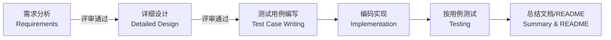

# 开发文档中心 (Development Documentation Hub)

本目录存放项目管理和工程过程相关的所有文档。目标是：**即使开发者中途更换，接手的人也能零压力地看懂"现在做到哪一步、为什么这么设计、接下来要做什么"**。

完整的工程规范见 [`PROJECT-CONVENTIONS.md`](PROJECT-CONVENTIONS.md)（目录结构、SDLC、文档/代码规范、人机协作模型、Git 提交规范）。

## 目录结构说明 (Folder Structure)

| 目录 | 内容 | 谁会看 |
|---|---|---|
| [`PROJECT-CONVENTIONS.md`](PROJECT-CONVENTIONS.md) | 项目工程规范总纲（目录结构、SDLC、文档/代码规范、人机协作模型） | 所有人，**必读** |
| [`runtime-constraints.md`](runtime-constraints.md) | 运行环境硬约束（机器归属、赛题规则、Vitis 环境、版本号）--**违反会导致卡死或返工** | 所有人，动手前必读 |
| [`requirements/`](requirements/) | 需求分析：赛道要求拆解 + 评审记录 | 所有人，尤其是新接手的人 |
| [`design/`](design/) | 详细设计：agent 架构、TUI 设计、知识库 schema、控制循环 | 开发者 |
| [`engineering-plan/`](engineering-plan/) | 工程计划：阶段划分 + 原子任务清单，**项目进度的唯一真相来源** | 所有人，最高频访问 |
| [`dev-log/`](dev-log/) | 开发日志：按时间顺序记录每次开发会话做了什么、遇到什么问题、如何解决 | 所有人 |
| [`reviews/`](reviews/) | 需求评审、设计评审的记录 | 所有人 |
| [`test-plan/`](test-plan/) | 测试用例与测试策略 | 开发/测试 |

> 注：`internal-notes/`（探索性笔记、技术债清单）和 `notes/`（外部论文/工具摘要）已从开源版本中移除。

## 软件工程流程 (SDLC Process)

本项目按以下顺序推进，**每个阶段结束都需要确认后才能进入下一阶段**：

- 需求分析和详细设计都要写到"细到不能再细"，并经过评审（记录在 `reviews/`）。
- 测试用例在详细设计完成后就要写好，覆盖所有功能点；纯 GUI 才能验证的部分如果没有自动化手段，会在用例中明确标注"人工验证 (M)"，不假装能自动化测试。
- 每完成一个阶段/一个原子任务，都会执行一次 git 提交并推送到 Gitee 远程仓库。
- 每进入一个新阶段时，先细化该阶段的原子任务，不要在项目一开始就把所有阶段的任务都列出来。

## 工程计划与原子任务 (Engineering Plan & Atomic Tasks)

进度管理的核心原则：**计划文档里不能只写“今天要做什么”，必须能让人一眼看到“整个项目被拆成了哪些原子任务、每个任务目前是什么状态”**。

详见 [`engineering-plan/engineering-plan.md`](engineering-plan/engineering-plan.md)。每进入一个阶段先把该阶段拆成原子任务，原子任务一定要细。

## 文档与代码规范 (Documentation & Coding Conventions)

### 代码注释规范

- 统一用 **Google style** docstring：模块/类/函数上方用三引号字符串 `"""..."""`，用 `Args:`、`Returns:`、`Raises:`、`Attributes:` 等段落标签（即使不是 Python 项目的语言也统一采用类似的段落式注释风格）。
- **所有代码注释必须是纯 ASCII 英文**，避免跨平台（尤其 Windows）编码问题。

### 代码配套文档规范

- 每个代码文件配一份 `<同名>.doc.md` 说明文档，中英双语（先中文后英文）。

### 项目管理文档语言约定

- 需求、设计、工程计划、开发日志等管理类文档以**中文为主**，关键术语标注英文。

### 目录命名规范

- 顶层目录单一职责，英文小写 + 连字符（如 `knowledge-base`），避免中文路径跨平台编码问题。

## 如何贡献一次开发记录 (How to Log Your Work)

每次开发会话结束前：

1. 在 `dev-log/` 下追加一篇日志（模板见该目录 README）。
2. 在 `engineering-plan/engineering-plan.md` 中更新对应原子任务的状态。
3. `git add` + `git commit`（提交信息清晰描述本次完成了什么）+ `git push` 到 Gitee。
