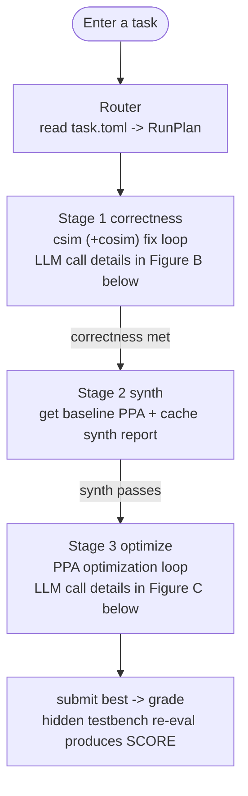
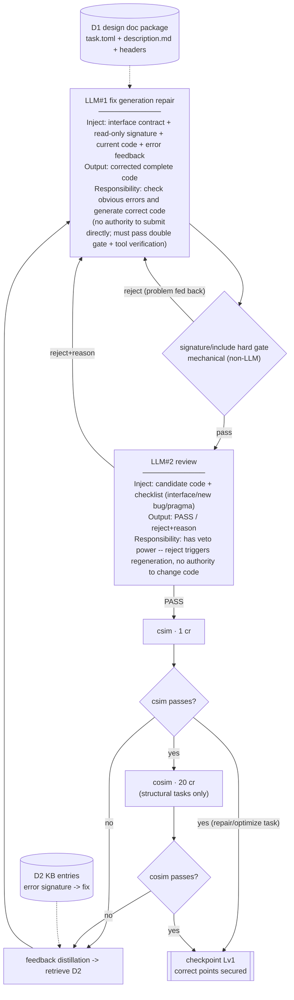
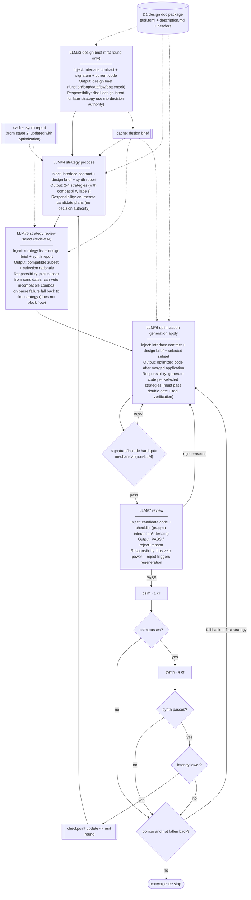
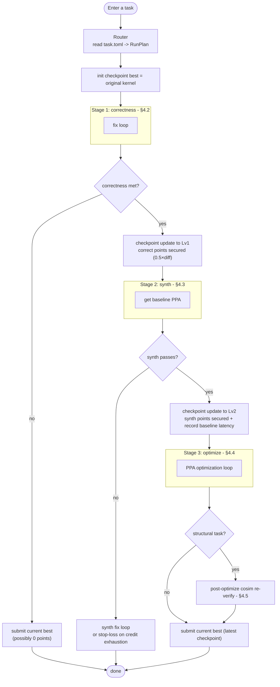
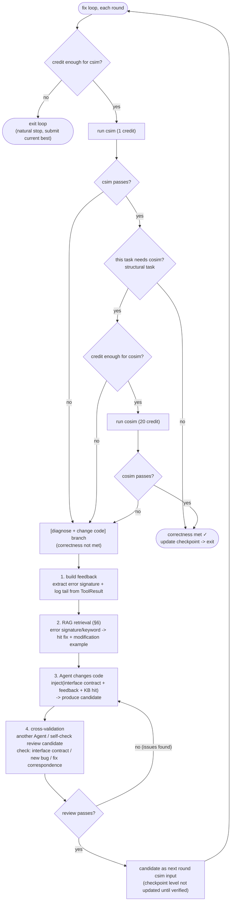
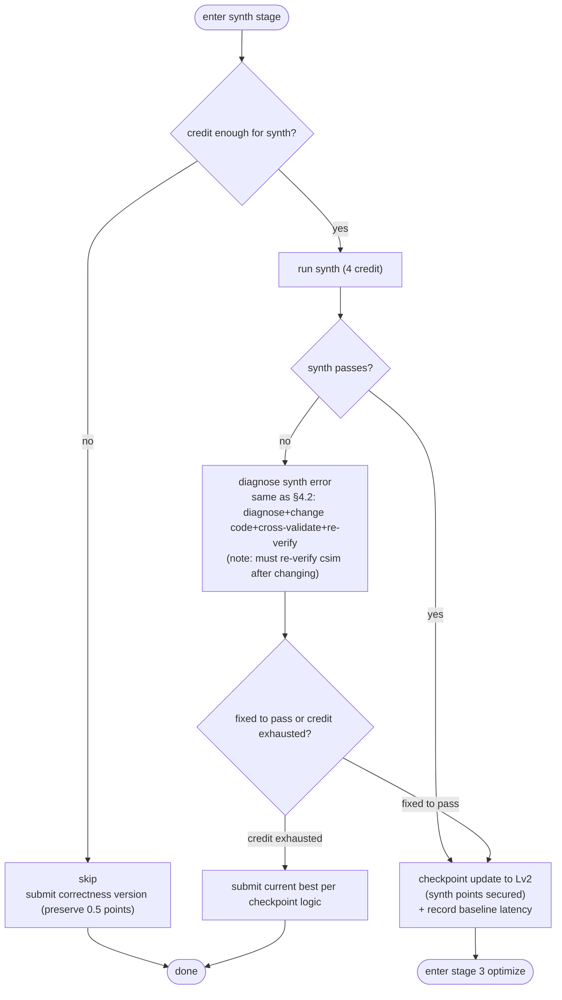
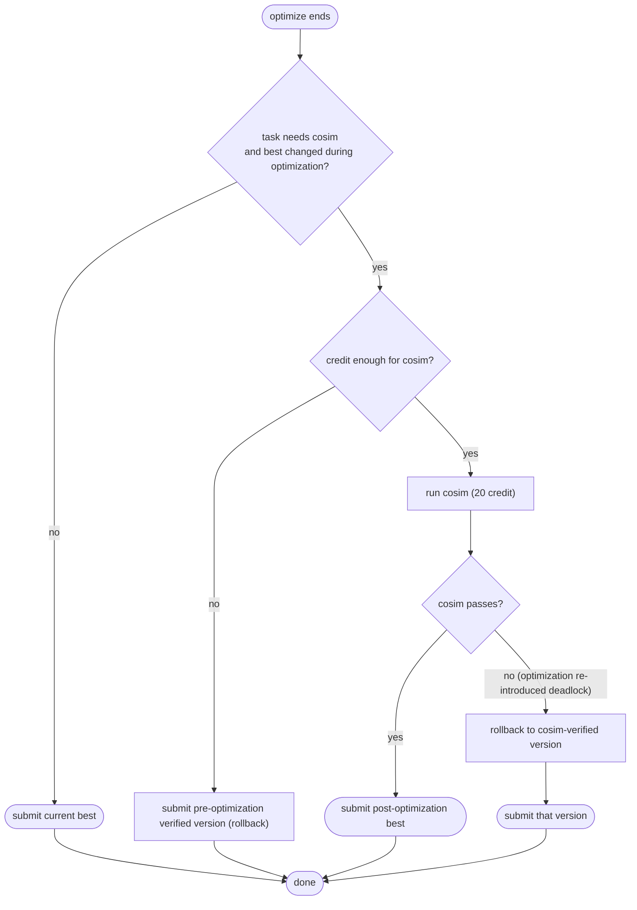

> [中文](agent-architecture.cn.md)

# Agent Architecture Design (Agent Architecture)

> Status: Draft v2.8 (2026-07-22)
> Phase: Architecture freeze before P2 kickoff
> Basis: Official harness (contest/fpt26-harness/) + AMD LLM4HLS SHA-256 case article + this repo's dev-log 2026-07-11-03
>
> **Iteration strategy (clarified in v2)**: The first iteration only pursues "achieving the highest correctness with the fewest compilations" and **does not consider token cost for now** -- Agent cross-validation is retained; token optimization comes after the system runs stably (from the second iteration on).

This document defines the overall architecture of the agent. All subsequent coding (the agent/ directory) follows this document.

---

## 0. Design Principles

1. **Fork the official harness, modify in place.** Reuse `ToolServer` / `Budget` / `Task` / `report.py` / `vitis.py` / `scoring.py`; only rewrite `agent.py` (the main loop) and add a knowledge-base module. Rationale: the evaluation interface is locked by the official harness as in-process function calls; rebuilding it yields no benefit.
2. **Single process, no RPC/multiprocessing.** The official `ToolServer` already runs vitis via subprocess; a tool crash will not take down the agent. Isolation is already satisfied.
3. **Linear flow + backtracking re-verification.** The main flow is linear (correct -> synth -> optimize), but after every code change you must go back and re-verify the gates already passed, because changing one place may break another.
4. **Checkpoint (save) mode.** The checkpoint is only updated when "the gate count is monotonically non-decreasing and, within the same gate, latency is lower". What is submitted is the latest checkpoint, not the last version that was changed.
5. **First iteration: pursue correctness only, do not consider tokens yet.** The goal is "achieve the highest correctness with the fewest compilations". Agent cross-validation is retained (to raise first-pass rate). Token optimization is a concern only after the system runs stably (from the second iteration on).
6. **Correctness takes priority over PPA.** The scoring formula makes correct a hard 0.5 threshold; synth+PPA together make up 0.5. Secure the 0.5 first, then push for the other 0.5.
7. **Agent cross-validation.** At key decision points (when a fix plan is settled, when an optimization strategy is selected) another Agent (or a same-model, different-prompt self-check) performs a review to raise the first-pass rate and reduce wasted retries. Token cost is not counted in the first iteration.

---

## 1. The Evaluation Model (the design foundation)

Every design decision of the agent is built on an understanding of the evaluation model.

### 1.1 The three gates (csim / synth / cosim)

| Gate | Cost | Essence | What it verifies | What it cannot see |
|---|---|---|---|---|
| **csim** | 1 credit | Pure software run of C++ (g++ compile + testbench) | Whether the algorithm logic is correct | Hardware (stream is treated as an unbounded FIFO, pragma as comments) |
| **synth** | 4 credits | Translates C++ into an RTL circuit, static analysis | Whether it can become a circuit; produces latency/II/resource reports | Runtime behavior (deadlocks are invisible) |
| **cosim** | 20 credits | Actually simulates the circuit running; stream is a real FIFO of depth 2 | Whether the hardware runs correctly at runtime (deadlock, timing, RTL/C mismatch) | - |

**Increasing precision, increasing cost.** If a gate fails at the previous gate, there is no point entering the next gate. But conversely: changing code to fix a later bug may break a gate that was already passed.

### 1.2 Two independent budgets

| | credit | token |
|---|---|---|
| What it is | Tool call count (csim/synth/cosim) | Word count consumed by LLM calls |
| Limit nature | **Hard limit**: exceeding it raises `BudgetExceeded` and stops | **Soft limit**: affects scoring but does not stop |
| When spent up | Can no longer call tools | Can still call, but points are deducted |
| Reward for saving | **None** (does not accumulate within a single task; score depends only on which gate is reached) | **Yes** (token is the final-eval metric; less usage = higher score) |

**Key conclusions (from discussion):**
- On the credit dimension, "go linearly as far as you can, retry on failure, stop when spent" achieves the same score as any "smart stop-loss" strategy. Saving credit has no value.
- The dimension that truly requires "trade-off" is tokens -- do not burn LLM calls on hopeless repeated retries. The agent's intelligence should focus on "making each step more likely to pass first time" (reducing retry count), not on "deciding when to stop".

### 1.3 Scoring formula (scoring.py:144-149)

```python
if not functional_pass:                    # hidden testbench did not pass
    score = 0.0
else:
    ppa_norm = min(acceleration, 8) / 8    # PPA normalization, capped at 8x acceleration
    quality = 0.5 * correct + 0.2 * synth_pass + 0.3 * ppa_norm
    score = difficulty * quality
```

Where `functional_pass = hidden_csim.ok and (cosim_pass is not False)`.

**Layered structure:**
- **correct (weight 0.5)**: csim passes + cosim passes (if requires_cosim). This is the hard threshold; failing it means a direct 0.
- **synth (weight 0.2)**: Can be synthesized into a circuit.
- **PPA (weight 0.3)**: Acceleration ratio of candidate latency relative to baseline.

**Note: scoring uses the hidden testbench, run outside the agent budget.** During agent development the public testbench is used; at scoring time the hidden testbench is used. Skipping a gate during development does not save points; scoring still verifies it.

### 1.4 task_type and gate requirements

The harness `task_type` field determines which gate the task's bug hides in and which gates correctness must pass:

| task_type | Typical initial state | correctness gates | Notes |
|---|---|---|---|
| **repair** | csim fails (functional bug) | csim | Algorithm error, caught directly by csim |
| **optimize** | csim passes, just slow | csim | Code has no bug, push for PPA |
| **structural** | csim passes, cosim fails | **csim + cosim** | Deadlock/streaming bug, only cosim can catch it |
| **generate** | Generate from starting code | csim (+cosim as needed) | Write from scratch |

---

## 2. Checkpoint Logic (Checkpoint)

This is the core data structure of the agent main loop. All code-change attempts go through checkpoint judgment.

### 2.1 Definition of gate completion

The "gate completion" of a code version V is an ordered tuple:

```
level(V) = (csim_pass, cosim_pass_if_required, synth_pass)
```

Lexicographic comparison: csim pass > cosim pass > synth pass.

More intuitively, map the completion to a 0-4 level (higher is better):

```
Lv0: nothing passed                       -> 0 points
Lv1: csim passes (and cosim passes if needed) -> correct points secured (0.5×diff)
Lv2: Lv1 + synth passes                   -> plus synth points (+0.2×diff)
Lv3: Lv2 + has latency data               -> can participate in PPA comparison
Lv4: Lv3 + latency better than baseline   -> PPA points (+0.3×diff)
```

### 2.2 Checkpoint judgment rules

Let the current checkpoint be B (best), the new attempt be C (candidate). Judge by priority:

1. **C's gate level > B** -> save unconditionally (C becomes the new best).
2. **C's gate level == B** -> compare latency: save only if C is faster; otherwise discard C.
3. **C's gate level < B** -> never save (correctness regression), discard C, B unchanged.

**Core: the checkpoint can only move forward (gates monotonically non-decreasing), and within the same gate the better one wins (lower latency).**

### 2.3 Source of speed data

- csim **does not return latency** (pure software run, no clock-cycle concept).
- synth returns latency (latency_worst / latency_avg parsed from csynth.xml).
- cosim returns measured latency (actually measured, more accurate).

**So "comparing speed" only makes sense at Lv2 and above (synth passed).** Between Lv0/Lv1 you can only compare gate counts.

### 2.4 Initial checkpoint

When entering a task, the initial checkpoint = the original kernel code. Its level depends on task_type:

| task_type | Initial code level |
|---|---|
| optimize | Usually Lv1 (csim already passes) |
| structural | Lv0 (cosim fails = correct not met) |
| repair | Lv0 (csim itself fails) |
| generate | Depends on starting code |

**For repair/structural tasks, the first scoring checkpoint is produced only after csim/cosim is first fixed.** This is the floor for these tasks.

### 2.5 Checkpoint carries built-in rollback

When changing code to fix an advanced bug breaks a lower-level gate, the failed version does not enter the checkpoint; best stays at the previously passed version -- automatic rollback. No extra rollback logic is needed.

---

## 3. The Router

The router runs once when a task is entered and decides which path to take subsequently.

### 3.1 Router inputs

- The `task_type` field of `task.toml` (**free read, costs no credit**)
- The `requires_cosim` field of `task.toml`
- `description.md` (the officially provided interface contract + initial-state description)
- The original kernel code

### 3.2 What the router does not do

- ❌ Does not judge "C vs HLS" (input is always HLS C++; the header has locked the signature)
- ❌ Does not "skip low-level gates" (scoring still verifies them; skipping has no benefit and carries risk -- fixing an advanced bug may break lower-level correctness, must re-verify)
- ❌ Does not run tools for diagnosis (saving credit is pointless, but here you shouldn't even spend credit -- task.toml is free information)

### 3.3 What the router does

The router selects the main loop's "gate path" based on task_type:

| task_type | Gate path | Notes |
|---|---|---|
| **repair** | csim fix loop -> synth -> optimize | Bug is exposed at csim; after fixing csim to pass, enter synth |
| **optimize** | (csim confirm) -> synth to get baseline -> optimize loop | Code is already correct; first csim-confirm for 1 credit (cheap insurance), then push PPA |
| **structural** | csim confirm -> **cosim fix loop** -> synth -> optimize | Deadlock only shows at cosim; correctness must include cosim |
| **generate** | csim fix loop -> (cosim if needed) -> synth -> optimize | Write from scratch; most likely csim fails first |

**The path difference is only "which gates correctness must pass":** repair/optimize only csim; structural needs csim+cosim. The rest (synth -> optimize) is identical for all types.

> **Secondary threshold for entering optimize (v2.8)**: The router still sets `needs_optimize=True` for all task types (the routing phase has no latency info), but the main loop checks after synth completes whether the baseline latency is reachable. If the synth-reported latency is 0 or missing (pure combinational logic II=1/latency=0, or a parse anomaly), `_valid_latency` returns None, and the main loop emits `optimize_skip reason=latency_unreachable` and skips optimize -- because scoring.py's `if cand_lat and base_lat:` treats 0 as falsy, acceleration is always None, the 0.3 PPA weight is unreachable for such tasks, and running optimize just wastes token/credit. Typical case: projection_bugfix (pure combinational logic, measured `Worst-caseLatency=0`).

### 3.4 Router output

The router produces a RunPlan, passed to the main loop, containing four fields:
- **task_type**: task type (repair/optimize/structural/generate)
- **correctness_stages**: gates that correctness must pass (e.g. [csim] or [csim, cosim])
- **needs_optimize**: whether to enter the PPA optimization phase
- **initial_level**: the gate level of the initial checkpoint (the starting point for checkpoint judgment)

---

## 4. Main Loop

The main loop is a linear flow + backtracking re-verification + checkpoint judgment. The following uses Mermaid flowcharts to convey the core structure (control flow contains branches and fallbacks, so flowchart rather than radial mindmap is used).

### 4.0 Full-flow overview (LLM-call annotation method v2)

§4.1-§4.5 are control-flow detail diagrams. This section is the full-flow overview, using a **set of annotation drawing conventions** so that even a passerby can see at a glance: how the flow goes, what is injected into each LLM call (where the information comes from, **dashed arrows connect directly**), what it outputs, and what authority it has.

**Drawing conventions (v2, 4 rules):**

1. **Node typing**: rectangle = LLM call (four-line card, see rule 2) or tool call (labeled with credit cost); cylinder = data source (numbered D1-Dn); subroutine shape = checkpoint/cache; diamond = decision/hard gate; stadium shape = start/end.
2. **LLM-call rectangle card has a fixed four lines**: `LLM#n name` / `Injection: what is injected` / `Output: product (review-type must state PASS / reject+reason)` / `Responsibility: one plain-language sentence stating the authority boundary` -- the responsibility line does not use abstract single words; it clearly states "what it does + whether it has veto power + what happens on failure", e.g. "check obvious errors and generate correct code (no authority to submit directly; must pass the double gate + tool verification)".
3. **Data flow drawn as dashed arrows**: injection sources (data sources / caches / upstream products) connect via dashed lines to the LLM node that consumes them; solid lines only carry control flow. For readability, **data sources are placed within the stage diagram that consumes them**, no long cross-stage dashed lines are drawn -- so the overview is split into three diagrams (skeleton + correctness + optimize) rather than one big diagram.
4. **The review double gate must be fully expanded**: mechanical (signature/include hard gate, non-LLM) is just a diamond; the LLM review must be a rectangle four-line card, and its two outgoing edges are explicitly labeled -- `reject+reason -> back to generation node`, `PASS -> next gate`.

**Responsibility/authority vocabulary** (keywords in the responsibility line use this set uniformly):

| Term | Meaning | Example |
|---|---|---|
| **Generate** | Only produces content, no decision authority | repair / apply_strategies / extract_design_brief / propose_strategies |
| **Select** | Picks from candidates, with a deterministic fallback on parse failure | select_strategies (fallback to first strategy) |
| **Rejectable** | reject triggers regeneration, no authority to change code directly | LLM review |
| **Hard gate** | Deterministic rule interception; failing means rejection (non-LLM) | mechanical_review (signature/include) |
| **Arbitrate** | Decides what enters checkpoint best (non-LLM) | checkpoint three rules |

#### Figure A: Full-flow skeleton (three stages + submit)



#### Figure B: correctness stage (LLM call details)



Note: On first entry, LLM#1 first does a "static checkup" (a free review costing no credit, directly inspecting the original code for obvious bugs); when it ran the residual task it fixed the deadlock pattern in one shot, saving a 20 cr failed cosim + 15-minute timeout.

#### Figure C: optimize stage (LLM call details)



**Reading-the-diagram example** (answering questions like "does review only select, or does it have reject power"): The two review roles are clear at a glance -- the `LLM#2/#7 review` responsibility line states "**has veto power** -- reject triggers regeneration", with two outgoing edges (reject goes back to generation node / PASS goes to tool verification); the `LLM#5 strategy review select` responsibility line states "**picks a subset from candidates**; can veto incompatible combos; on parse failure falls back to first strategy (does not block flow)" -- it can veto the proposer's compatibility claim, but its own failure does not block the flow.

### 4.1 Overall flow



### 4.2 Stage 1: correctness (fix loop)

Goal: make the code pass all gates required for correctness (repair/optimize tasks = csim; structural tasks = csim + cosim).



**Key points:**
- A failed round does not update the checkpoint level -- best stays at the last passed version; the failed candidate rolls back automatically.
- Cross-validation was added in v2; the first iteration does not count token cost, aiming to raise the first-pass rate and reduce wasted retries.
- A KB hit may simultaneously provide a "fix description" and a "mature modification example" (see §6.4).

### 4.3 Stage 2: synth (get baseline PPA)

Goal: verify synthesizability + obtain baseline latency data (synth points 0.2 + provide a baseline for optimization).



**Key points:** When synth fails, the fix loop is also used (RAG retrieval for synth-class fixes + cross-validation), but after each change csim must be re-verified (changing synth may break correctness, see §5).

**Fix loop refinement (v2.3):**
- Each round's order: synth failure feedback -> `build_feedback` extracts error signature (XFORM/RTGEN error codes + keywords) -> KB retrieval -> `repair` (inject interface contract + feedback + KB hit) -> double-layer review -> **re-verify csim first** (1 credit, cheap) -> only if csim passes, run synth again (4 credits).
- Re-verify csim fails: the candidate carries csim feedback into the next fix round (no wasting 4 credits to synth a version whose correctness is already broken).
- Round cap `max_synth_rounds = 3`: each round costs at worst csim 1 + synth 4 = 5 credits; 3 rounds = 15 credits, with the budget check (`can_afford`) as a double safeguard. Stop when fixed or credit/rounds exhausted; when exhausted, submit current best per checkpoint logic (preserve correctness points).
- After synth passes, record `synth_summary` (a one-line summary of latency/II/resources) for injection into the §4.4 optimize stage.
- **Invalid latency value defense**: when the parsed latency is None or ≤0 it is treated as invalid data (on real hardware a synth-passed-but-latency=0 parse anomaly occurred) and does not participate in checkpoint comparison, preventing a "0 cycle" from being misjudged as the fastest.

### 4.4 Stage 3: optimize (PPA optimization loop)

Goal: given correctness + synth both pass, reduce latency to push for PPA points (0.3 weight).

> The diagram in this section is from the control-flow perspective (nodes are labeled with LLM# numbers); the injection/output/responsibility annotations for each LLM call are in §4.0 Figure C.

```mermaid
flowchart TD
    Entry([enter optimize]) --> Ctx["AMD Phase 1: Context Loading<br/>① official design doc description+headers<br/>② design brief extraction extract_design_brief (LLM#3)<br/>   (LLM summarizes current kernel: function/loop structure/<br/>   dataflow/bottleneck guess, cached once)<br/>③ synth report (latency/II/resources)<br/>④ device constraints (U55C @ 200MHz)"]
    Ctx --> Snap["checkpoint snapshot<br/>(for structural rollback, §4.5)"]
    Snap --> Lp

    Lp([optimization loop, each round]) --> Q1{credit enough for<br/>csim + synth?}
    Q1 -- no --> Exit([exit loop])

    Q1 -- yes --> AMD["LLM#4 propose_strategies (Phase 2a)<br/>inject(design doc+design brief+latest synth report)<br/>propose 2-4 strategies + tradeoffs<br/>each labeled combinable_with (compatibility)"]
    AMD --> Sel["LLM#5 select_strategies review AI (Phase 2b)<br/>feasibility review (veto poisoned strategies) + re-check compatibility<br/>pick subset (1~N) + rationale<br/>★ double confirmation: proposer+reviewer both agree<br/>non-interfering before combo is allowed"]
    Sel --> Gen["LLM#6 apply_strategies (Phase 3)<br/>selected subset [merged application] into one candidate<br/>(single strategy = N=1 special case)"]
    Gen --> M2{"signature/include hard gate<br/>mechanical (non-LLM)"}
    M2 -- reject --> Gen
    M2 -- pass --> Review["LLM#7 review<br/>focus: multi-strategy pragma interaction /<br/>interface breakage / AMD-named weak spots"]
    Review --> Q2{review passes?}
    Q2 -- no (reject+reason) --> Gen

    Q2 -- yes --> Recheck["re-verify (code change may break passed gates, §5)"]
    Recheck --> RCsim["run csim"]
    RCsim --> QC{csim passes?}
    QC -- no --> QR{single strategy and<br/>repair not exhausted?}
    QR -- yes --> Rep["optimize_repair (v2.8)<br/>inject: failure feedback (error code+log tail)+KB hit<br/>re-run apply_strategies + re-verify"]
    Rep --> RCsim
    QR -- no --> FB1["combo failure attribution fallback (v2.4)"]
    QC -- yes --> RSynth["run synth"]
    RSynth --> QS{synth passes?}
    QS -- no --> QR

    QS -- yes --> Cmp["checkpoint judgment (§2 rule 2)<br/>compare latency at same level"]
    Cmp --> QL{candidate latency <<br/>best latency?}
    QL -- yes --> Update["update checkpoint + synth_summary<br/>continue next round"]
    Update --> Lp
    QL -- no --> FB1

    FB1 --> QF{subset >1 strategy<br/>and not fallen back?}
    QF -- yes --> FB2["optimize_fallback:<br/>regenerate+re-verify with only subset's first strategy<br/>(v2.7: inject failure feedback)"]
    FB2 --> Gen
    QF -- no --> Stop(["stop optimization"])
```



**Key points:**
- **Optimization must extract the design doc before improving (v2.3 clarified)**: all three pieces of AMD Phase 1 Context Loading are indispensable -- ① official design doc (task.description interface contract + headers, to prevent optimization from breaking the interface); ② design brief extraction (`extract_design_brief`: the LLM first extracts function/loop structure/dataflow/bottleneck guess from the current kernel, done once and cached before the optimize loop starts, injected each round); ③ synth report (latency/II/resources). AMD's core lesson: "without synthesis data, the LLM can only give generic advice" -- likewise, without design intent, the strategies the LLM gives don't fit the actual code.
- **Strategy combination + review AI (v2.4, replacing v2.3's "take first strategy" heuristic)**: strategies are no longer single-select. The proposer labels each strategy with `combinable_with` (which strategies it does not interfere with) in `propose_strategies`; the review AI `select_strategies` (same model, different prompt self-check, the established form in §11) re-checks compatibility and picks a subset. **Double-confirmation rule: only when both proposer and reviewer agree the strategies are non-interfering does the code AI merge multiple strategies into one candidate** (pragma-class optimizations are naturally combinable -- PIPELINE inner loop + ARRAY_PARTITION arrays + DATAFLOW top level -- verifying multiple strategies at once is the most credit-efficient).
- **Review AI expanded to "feasibility + compatibility" double review (v2.7)**: compatibility checking alone is not enough -- a strategy may sound nice and be mutually compatible, but the plan itself is poisoned (e.g. "change the signature to add a parameter" breaks the interface contract, replacing a data type breaks functionality). `select_strategies` now first does a **feasibility review** of each strategy (interface unchanged / functionality not broken / synthesizable / resources not exceeded); poisoned strategies are vetoed along with their reasons (the `rejected` list is recorded with the event + shown in TUI), then a compatible subset is picked from the survivors. This way "low-level errors at the strategy-plan level" are intercepted before selection, not wasting the subsequent generation+verification cost (low-level errors at the apply stage are still caught by the double gate + re-verification; the two layers complement each other).
- **Structured output (v2.7)**: DeepSeek natively supports `response_format: {"type": "json_object"}` (verified by a real-machine probe). propose/select switch to strict JSON mode (schema-ized fields); regex parsing is demoted to a fallback path for non-JSON backends (ScriptedClient) -- eliminating the entire class of "LLM output format divergence" failures.
- **Failure fallback changed to failure-aware (v2.7)**: v2.4's fallback was a "blind fallback" (combo failure directly tries the subset's first strategy). From v2.7, the fallback injects the failing tool's feedback (error code + log tail) into the apply prompt -- the LLM knows where it failed last time (e.g. "pragma written at file scope"), corrects and retries, instead of blindly re-gambling.
- **Failure fallback does combo attribution (v2.4)**: when a combo candidate fails (csim fails/synth fails/no improvement), you cannot know which strategy caused it -- fall back to the subset's first strategy alone, regenerate + re-verify once; only if that still fails do you stop optimizing. At most 2 candidate verifications per round (10 credits).
- **Round cap `max_optimize_rounds = 4` (set in v2.3)**: each round costs at worst 2×(csim 1 + synth 4) = 10 credits. Taking dotProduct (budget=40) as an example: correctness ~2 + synth 4, ~34 left, 4 rounds leaves margin; the `can_afford` check naturally truncates.
- **Stop conditions (any one hits)**: single-strategy candidate repair exhausted and still fails / still fails after fallback / credit not enough for csim+synth / round cap reached.
- **Optimize verification-failure repair (v2.8, symmetric with §4.2/§4.3)**: v2.4-v2.7's optimize was the only one of the three stages without a repair loop -- csim/synth failure meant discard + stop (single strategy) or blind fallback (combo). This exposed a problem on real hardware: the LLM-generated ROM lookup-table array initialization wrote 66 extra elements causing a `compile_error`, and the agent gave up on optimize instead of fixing it. From v2.8, a **single-strategy** candidate that fails csim/synth enters a repair loop: `build_feedback`'s error code + log tail + KB hit are injected into the next round's `apply_strategies`, and the LLM regenerates with the failure reason, up to `max_opt_repair=3` times, or stops when credit is insufficient for one csim+synth. **Combo candidates** that fail still go through combo attribution fallback (no repair, isolate the cause first); the single-strategy candidate after fallback enters its own repair loop only if it fails again -- the two layers complement each other.
- After optimization changes the code, csim must always be re-verified (+ cosim if structural) -- pragma changes are an AMD-named LLM high-error spot; the pragma-interaction risk of combo candidates is higher, so the review focus must name multi-strategy interaction.
- A new synth-passed report also updates the cached `synth_summary`; the next round of strategy exploration is based on the latest data.

### 4.5 Post-optimization cosim re-verification for structural tasks

After the structural-task optimize stage changes code, cosim must be additionally re-verified -- optimization may re-introduce a deadlock (ReferenceAgent agent.py:198-209 does exactly this):



**Rollback semantics (v2.3 clarified, fixing an implementation bug)**: On entering optimize, a **snapshot** of the checkpoint (code/level/latency/cosim_ok) is taken. Rollback = restoring the checkpoint to the snapshot as a whole, not just logging a line -- there was once an implementation bug where a cosim re-verify failure only wrote a rollback event while the final submission still carried the deadlock. The two preconditions for triggering re-verification (corresponding to Q1): ① best changed relative to the snapshot (no change means optimization produced nothing, no need to spend another 20 credits); ② credit is enough for cosim (structural tasks must roll back the snapshot even if credit is insufficient; do not gamble).

**Scope extended to all task types (v2.7)**: re-verification is no longer limited to structural tasks. The synth report is a static estimate, not a measured value (the residual task measured synth estimating 68 cycles vs cosim measuring 97); although the optimize task's correctness gate does not include cosim (scoring doesn't check either), the optimized kernel having never run at the RTL level is a verification gap -- especially since the LLM's aggressive pragma combinations may introduce RTL hazards invisible to csim/synth. Therefore: **for any task type, as long as best changed during optimization and credit is sufficient, run a final cosim checkup; on failure, always roll back the snapshot**. Non-structural tasks skip when credit is insufficient (best-effort, just log an event); structural tasks must roll back when insufficient (do not gamble).

---

## 5. The Cascading Impact of Changes (why backtracking re-verification is mandatory)

This is the key insight of the entire architecture: **changing code to fix a bug in one gate may break another gate that already passed.**

| What you change | What it may break |
|---|---|
| Fix a cosim deadlock (refactor dataflow) | csim logic (introduce an algorithm error during refactor) |
| Fix a synth error (change pragma/structure) | csim logic + cosim deadlock |
| optimize (add pragma to reduce latency) | csim logic + cosim deadlock (an LLM weak spot named by the AMD article) |

**Therefore, after every code change in the main loop, the correctness gates must be re-verified.** The checkpoint mechanism guarantees "fail re-verify -> roll back" -- the failed version does not enter best.

---

## 6. RAG Knowledge Base (debugging enhancement)

The knowledge base is the agent's core value-add over the official ReferenceAgent, covering the LLM weak spots named in the AMD article.

### 6.1 Knowledge-base positioning

- **Form**: structured data (JSON/YAML) + keyword/error-code matching, not a wiki/search engine.
- **Retrieval timing**: injected only when a specific error signature is parsed during the fix stage; not injected normally (saves tokens).
- **Each entry's structure**: `error_code + symptom + root_cause + fix_pattern + example`

### 6.2 Knowledge-base coverage (by stage)

| Stage | Coverage | Source |
|---|---|---|
| P2 (correctness) | Compile errors + csim functional bugs + cosim deadlock/streaming | HLS Repair paper + AMD cases |
| P3 (expand cosim) | DATAFLOW deadlock, AXI-Stream handshake (TLAST/TREADY/TVALID), ap_ctrl timing | Compiled by teammates |
| P4 (PPA) | When to use pipeline/unroll/array_partition/dataflow/bind_op | PPA optimization cheat sheet |

### 6.3 Retrieval method (two types, implemented by stage)

**Type 1: error signature matching (first iteration, P2 must-do)**

- String-match error codes (e.g. `[XFORM 203-313]`) + keyword match (e.g. "deadlock" "FIFO").
- On hit, inject: error-code fix + root cause + fix description.
- Consider embedding only when the volume grows. Keep it simple first.

### 6.4 Functional pattern / mature-modification-example retrieval (second iteration, optional)

User insight: besides "find a fix by error code", you can also "find a mature modification example by code functional pattern". For example, when the agent sees a `for` loop accumulation in the kernel, the knowledge base directly matches "for-loop accumulation -> standard modification of adding a PIPELINE pragma (with before/after comparison example)"; the LLM just follows it, no need to reason from scratch.

**Retrieval logic:**
- In addition to error-signature matching (§6.3), additionally perform functional-pattern recognition on the current kernel (e.g.: sequential accumulation loop / nested loop / array access / stream read-write order).
- On hit, inject: mature modification example (before/after code comparison) + applicable conditions + caveats.
- This is equivalent to giving the LLM a "standard-answer fragment", lowering reasoning difficulty and raising the first-pass rate.

**Example entry form:**
- Functional pattern label: `sequential_accumulation_loop`
- Applicable scenario: a single-layer for loop accumulates over an array, no dependencies
- Mature modification example:
  - before: `for (i) result += a[i]*b[i];`
  - after: `for (i) { #pragma HLS PIPELINE result += a[i]*b[i]; }` + matching ARRAY_PARTITION
- Caveat: insufficient partitioning leads to II>1

**Implementation-complexity assessment:** functional-pattern recognition is harder than error-code matching -- you must first do a structural abstraction of the kernel code (recognize "this is an accumulation loop"), then do pattern matching. The user judged this might be difficult to implement, so **it is not done in the first iteration; deferred to the second iteration**. First rely on error-signature matching + the LLM's own ability to close the loop, then add it once stable.

---

## 7. Mapping to the AMD Four-Phase Workflow

| AMD phase | Our implementation | Module |
|---|---|---|
| **Phase 1: Context Loading** (source code + synth report + device constraints) | Fix stage injects task.description + header; optimize stage injects design doc + design brief + synth report (§4.4) | reach_correctness / optimize |
| **Phase 2: Strategy Exploration** (propose multiple strategies + weigh then select) | optimize stage's `llm.propose_strategies` (with compatibility labels) + `llm.select_strategies` review AI double-confirmation subset selection | optimize |
| **Phase 3: Code Generation** | `llm.repair` / `llm.apply_strategies` (combo subset merged application) | reach_correctness / optimize |
| **Phase 4: Validation** (synthesis + simulation + feedback loop) | csim/synth/cosim re-verification + checkpoint judgment | main loop throughout |

---

## 8. LLM Call Layer (to be refined in P2)

### 8.1 Interface

Reuse the harness `LLMClient` Protocol (`complete(system, user) -> str`), wrapping domain-specific methods on top:
- **repair**: given task, current code, tool feedback, KB hit -> returns fixed candidate code (or failure).
- **review**: cross-validate the candidate (interface unchanged / no new bug / pragma conflict).
- **extract_design_brief** (added v2.3): given task, current code -> returns design-brief text (function / loop structure / dataflow / bottleneck guess). Called once and cached before the optimize loop starts (§4.4 Phase 1).
- **propose_strategies**: given task, current code, synth report, design brief -> returns multiple optimization strategies (with benefit/resource/risk tradeoffs + `combinable_with` compatibility labels, v2.4). From v2.7 uses JSON structured output (`response_format: json_object`); regex parsing is only a fallback for non-JSON backends.
- **select_strategies**: review AI (same model, different prompt self-check). Given task, strategy list, synth report, design brief -> from v2.7 does a **feasibility+compatibility double review**: judge ok/veto per strategy (poisoned plans are vetoed along with their reasons, output a `rejected` list), then pick a compatible subset (1~N) + a one-sentence rationale. On parse failure, retry once; if still failing, fall back to the first strategy and mark `fallback=true` in the event (does not block the flow, but is visible).
- **apply_strategies**: given task, current code, selected strategy subset (+ optional failure feedback, v2.7) -> returns candidate code after **merged application** of the subset (or failure). A single strategy is the N=1 special case; with failure feedback the LLM can avoid the previous error.

**Prompt-content hard requirement (v2.3 clarified)**: the user prompt of all code-changing methods (repair / propose_strategies / apply_strategy) must inject ① task.description (official design doc / interface contract) ② headers (read-only signature) -- optimize-class methods additionally add ③ synth report summary ④ design brief. Missing ①② leads the LLM to give generic advice divorced from the interface contract (AMD Phase 1 lesson).

### 8.2 Model selection

The contest requires an open-source model; three candidates are recommended for comparison:
- DeepSeek V4 Pro (1.6T MoE, 1-million context)
- Qwen3.5 122B A10B (AWQ 4bit)
- Qwen3.6 27B (Dense, 262K context)

During development you can use the environment's built-in GLM for debugging; switch to the target model for production.

### 8.3 Output parsing

Require the LLM to return a fenced code block (```cpp ... ```), reusing ReferenceAgent's `_extract_code` regex.

---

## 9. Module Layout (agent/ directory structure)

```
agent/
  __init__.py
  router.py          router: task_type -> RunPlan
  checkpoint.py      checkpoint logic: level comparison + checkpoint judgment (§2)
  main_loop.py       main loop: run() + reach_correctness + optimize (§4)
  llm_client.py      LLM call wrapper: repair/propose_strategies/apply_strategy (§8)
  feedback.py        feedback construction: build LLM-friendly feedback text from ToolResult
  knowledge_base/    RAG knowledge base (§6)
    __init__.py
    retriever.py     retriever (keyword/error-code matching) + KBEntry schema
    entries.py       corpus loader (seed_entries() compat entry, from v0.7.1)
    entries.json     entry corpus (22 entries, single JSON source; pure stdlib, no PyYAML)

contest/fpt26-harness/llm4hls/   ← official harness, forked and modified in place
  agent.py           ← replaced with our main_loop (or keep reference version for comparison)
  (other files reused)
```

---

## 10. Things Not Done (explicitly excluded)

- ❌ Multiprocess/RPC architecture (the official ToolServer is already an in-process function call)
- ❌ A "skip low-level gates" routing strategy (scoring still verifies, and code changes break passed gates)
- ❌ "White-box inspection + logical deduction" as the primary verification means (rely on running csim/synth/cosim, not on the LLM thinking)
- ❌ A "rewrite on ≥3 errors" rule (under credit constraints rewriting easily goes bankrupt; modification-first)
- ❌ A complete detailed design doc (a single-function kernel needs no inter-function coupling analysis; header + description.md is already the official design doc)
- ❌ Token optimization in the first iteration (first iteration only pursues correctness; token optimization is a matter from the second iteration on, after the system runs stably)
- ❌ Functional-pattern retrieval in the first iteration (high implementation complexity; first close the loop with error-signature matching)
- ❌ WebUI in the first iteration (structured logging + tail -f is enough; the data source is reusable, see §12)

---

## 11. To Be Refined (decided during P2 coding)

- [x] Prompt templates for each stage (system prompt + user prompt structure) -- set in v2.3: see §8.1 hard requirement + llm_client.py module-level templates
- [x] Precise field definition of the KB-entry schema -- decided: KBEntry (id/symptom/root_cause/fix/example/signatures), see retriever.py
- [x] Default values of max_rounds / max_optimize_rounds -- set in v2.3: max_rounds=6 (ref ReferenceAgent), max_synth_rounds=3, max_optimize_rounds=4, rationale in §4.3/§4.4
- [x] The "which strategy to pick" strategy for Strategy Exploration -- set in v2.3: fixed heuristic taking the first, re-propose each round (§4.4)
- [x] The concrete form of cross-validation (independent agent vs same-model different-prompt self-check) and trigger timing -- first iteration uses same-model different-prompt self-check (the code review gate + v2.4 strategy review select_strategies, two places); cross-model independent review deferred to the second iteration
- [ ] Token-count instrumentation (first iteration does not optimize, but instrumentation is done first for second-iteration analysis) -- **second iteration**
- [ ] The code-structure abstraction method for functional-pattern retrieval -- **second iteration**
- [ ] A/B comparison evaluation plan against the official ReferenceAgent

---

## 12. Observability

An agent run on a single task may last from minutes to tens of minutes (a single cosim up to 15 minutes). Running fully black-box makes it impossible to judge "which step, whether stuck, why no progress". This section defines logging, auditing, liveness monitoring, and timeout layering.

### 12.1 Log layers

Three log layers, each with its own job:

| Layer | Carrier | What it records | Who consumes it |
|---|---|---|---|
| **Audit layer** | harness transcript (existing) | Each tool call: sequence number, kind, phase, spent credit, brief | Post-hoc review, evaluation report, token analysis |
| **Structured log** | stdout + JSONL file (new) | Semantic events at each agent decision point (see §12.2) | Real-time observation (tail -f), post-hoc analysis |
| **Liveness heartbeat** | A separate heartbeat line/file (new) | Seconds since last activity, current stage, credit remaining | Stuck detection |

### 12.2 Structured log points (agent main loop must record)

Write structured logs (JSONL, one line per entry, easy for post-hoc grep/jq analysis) at the following decision points:

| Node | Log event | Key fields |
|---|---|---|
| Routing decision | `route` | task_id, task_type, correctness_stages, initial_level, budget |
| Before/after csim call | `tool_call` / `tool_result` | kind=csim, phase(pass/fail/compile_error...), rc, elapsed_s, credit_spent |
| Before/after synth call | same | kind=synth, + latency/II/resources (if passed) |
| Before/after cosim call | same | kind=cosim, + deadlock/rtl_mismatch flags |
| RAG retrieval | `kb_search` | query (error signature/keyword), hits (number of hit entries), hit_ids |
| LLM call | `llm_call` | purpose(repair/strategy/apply/review), model, prompt_tokens, completion_tokens |
| Cross-validation | `review` | reviewer, verdict(pass/reject), issues (problems found), retry_count |
| Checkpoint change | `checkpoint` | old_level, new_level, old_latency, new_latency, reason |
| Stage transition | `phase_enter` / `phase_exit` | phase(correctness/synth/optimize), best_level, credit_remaining |
| Budget exhaustion | `budget_exhausted` | spent/total, last_best_level, last_attempt |
| Submit | `submit` | final_level, final_latency, total_credit, total_llm_calls |

### 12.3 Liveness heartbeat (stuck detection)

Every N seconds (suggested 10s) write a heartbeat containing:
- `age_s`: seconds since the last meaningful activity (tool call completion / LLM return / checkpoint change)
- `current_stage`: current stage (correctness / synth / optimize / waiting for csim / waiting for LLM ...)
- `credit_remaining`: remaining credit
- `llm_calls`: cumulative LLM call count

**Stuck judgment**: when the heartbeat's `age_s` exceeds the threshold, mark it `STALE`. The threshold differs by what it is currently waiting for:
- Waiting for csim: reasonable upper bound 180s (harness already has a SIGKILL timeout)
- Waiting for synth: reasonable upper bound 600s
- Waiting for cosim: reasonable upper bound 900s
- Waiting for LLM: reasonable upper bound 180s (OpenRouterClient already has this timeout)
- **If age_s still exceeds the corresponding threshold while STALE, it means the timeout mechanism may not be taking effect and manual intervention is needed**

**Observation method**: the first iteration uses `tail -f heartbeat.jsonl` for real-time viewing; STALE lines use a prominent prefix. From the second iteration on, this can be upgraded to a TUI/WebUI consuming the same data source.

### 12.4 Timeout layering (double safeguard)

| Layer | Mechanism | Existing/new | What it prevents |
|---|---|---|---|
| **Tool timeout** | csim 180s / synth 600s / cosim 900s; on timeout SIGKILL the entire process group | ✅ harness existing (vitis.py:63-69) | vitis/RTL simulation hang, deadlock |
| **LLM call timeout** | 180s; on timeout raise an exception | ✅ harness existing (llm.py:89) | OpenRouter not returning |
| **Liveness alarm** | heartbeat age_s exceeds threshold -> mark STALE | 🆕 new | Fallback when the above timeouts fail (e.g. subprocess leak, network silence) |

The first two layers are hard timeouts (directly kill/raise); the third is a soft alarm (marks but does not auto-handle, left to a person or subsequent auto-retry logic).

### 12.5 Relationship to the transcript

- **transcript (harness)**: records only tool calls; authoritative, tamper-proof; used for evaluation audit and the final scoring report.
- **Structured log (new)**: records agent decision semantics (routing, RAG, review, checkpoint), which the transcript does not contain.
- **The two are correlated via `task_id` + tool-call sequence number**; post-hoc they can be joined to reconstruct the complete run trajectory.

### 12.6 Things not done (first iteration)

- ❌ WebUI (3-5 days of dev effort; the first iteration uses structured logging + tail -f, which is enough; the data source is designed to be reusable, and the second iteration's upgraded panel consumes the JSONL directly).
- ❌ Automatic stuck recovery (the first iteration's STALE only alarms, with manual judgment; auto-retry logic waits for accumulated experience).

---

## Change Log

| Date | Change | By |
|---|---|---|
| 2026-07-22 | v2.8. The real-machine projection_bugfix run exposed two problems, fixed accordingly: ① **secondary threshold for entering optimize -- latency reachability**: projection_bugfix is pure combinational logic (II=1/latency=0); scoring.py's `if cand_lat and base_lat:` treats 0 as falsy, making acceleration always None and the 0.3 PPA weight unreachable. The main loop checks the baseline latency after synth completes; if `_valid_latency` returns None it emits `optimize_skip reason=latency_unreachable` and skips optimize (no wasting token/credit). The criterion is latency reachability, not task_type (harness scoring is uniform across all task types; repair tasks theoretically have PPA points; needs_optimize has been True since the first version, not newly introduced). ② **optimize verification-failure repair loop (symmetric with §4.2/§4.3)**: v2.4-v2.7 optimize was the only one of the three stages without a repair loop -- csim/synth failure meant discard+stop. The LLM-generated ROM lookup-table array initialization wrote 66 extra elements causing a `compile_error`, and the agent gave up instead of fixing. From v2.8, a single-strategy candidate that fails csim/synth enters a repair loop (`build_feedback` error code+log tail+KB hit injected into `apply_strategies`, up to `max_opt_repair=3` times or until credit insufficient); combo candidates still go through combo attribution fallback (no repair, isolate cause first), and the single-strategy candidate after fallback enters its own repair loop only if it fails again -- the two layers complement each other. TC-003 updated, TC-018/TC-019 added. | Agent lead |
| 2026-07-19 | v2.7. Upgraded optimize decision quality per three user-feedback points: ① **structured output** -- DeepSeek `response_format: json_object` verified by a real-machine probe; propose/select switch to strict JSON schema, regex parsing demoted to a non-JSON backend fallback (eliminating the output-format-divergence class of failures); ② **review AI expanded to feasibility+compatibility double review** -- select_strategies judges ok/veto per strategy (poisoned plans like those breaking the interface contract go into the rejected list with reasons, shown in TUI), then picks a compatible subset from survivors; ③ **blind fallback changed to failure-aware fallback** -- on combo failure, the failing tool's feedback (error code+log tail) is injected into the fallback apply prompt, and the LLM retries avoiding the previous error. Also: select parse failure now retries once then falls back; the fallback is marked `fallback=true` in the strategy_select event (visible, no longer silent). | Agent lead |
| 2026-07-19 | v2.6. §4.0 redone per user feedback (annotation method v1->v2): ① injection source changed from "in-card numbered comments" to **real dashed-arrow connections** (data sources/caches placed within the consuming stage diagram, no long cross-stage dashed lines); ② the overview split from one big diagram into three (Figure A three-stage skeleton / Figure B correctness detail / Figure C optimize detail), layout readability first; ③ responsibility line changed from abstract single words to a plain-language sentence (e.g. repair="check obvious errors and generate correct code (no authority to submit directly; must pass double gate + tool verification)"); ④ the review double gate fully expanded -- mechanical as a diamond (non-LLM hard gate), LLM review as a rectangle four-line card, outgoing edges explicitly labeled "reject+reason->back to generation node / PASS->next gate"; ⑤ "pre-csim free review" renamed to LLM#1 fix generation (first round = static checkup, with a residual instance note). All three diagrams verified by mermaid-cli rendering. | Agent lead |
| 2026-07-18 | v2.4. §4.4 Phase 2/3 rewritten (three user decisions): ① strategy changed from "take first strategy" to **combo subset** -- propose labels each strategy with `combinable_with`, new review AI `select_strategies` (same model, different prompt self-check) re-checks compatibility and picks a subset, **double confirmation (proposer+reviewer both agree non-interfering) before combo is allowed**, `apply_strategies` merges the subset into one candidate; ② failure fallback does combo attribution: combo candidate fails/no improvement -> fall back to subset's first strategy alone -> stop only if still fails (at most 2 candidates 10 credits per round); ③ review focus adds "multi-strategy pragma interaction". §7 mapping table, §8.1 interface (select_strategies added, apply_strategies multi-strategy signature), §11 cross-validation form note synced. | Agent lead |
| 2026-07-18 | v2.3. Filled four gaps per implementation gaps: ① §4.3 synth fix loop refined (each round re-verify csim before synth, max_synth_rounds=3, invalid-latency-value defense); ② §4.4 optimize loop refined (Phase 1 Context Loading trio: official design doc + extract_design_brief design brief + synth report; take-first-strategy heuristic; max_optimize_rounds=4; stop conditions); ③ §4.5 rollback semantics clarified (snapshot restored as a whole, fixing the "only logs, doesn't really roll back" implementation bug; re-verify precondition changed to "cosim in correctness_stages and best changed"); ④ §8.1 prompt hard requirement (code-changing methods must inject description+headers) + extract_design_brief interface. §7 mapping table, §9 module layout (entries.py), §11 four to-be-refined items closed, synced. | Agent lead |
| 2026-07-14 | v2.2. Three items: ① fixed §4.1 overview diagram checkpoint logic (added explicit checkpoint-update nodes Ckpt1/Ckpt2 after correctness/synth met + synth-failure stop-loss branch); ② added §12 observability (three-layer logs: transcript/structured-JSONL/heartbeat; 12 log points; liveness STALE alarm; double-layer timeout + fallback; correlation with transcript); ③ set the observability plan -- first iteration uses structured logging + tail -f, no WebUI (data source reusable, second iteration upgrades). | Agent lead |
| 2026-07-14 | v2.1. Per user feedback, converted the entire §4 main loop to Mermaid flowcharts (5 diagrams: overall flow + correctness fix loop + synth + optimize + structural re-verify), replacing the original ASCII art. Control flow contains branches and fallbacks, so flowchart rather than radial mindmap is used. | Agent lead |
| 2026-07-14 | v2. Three changes per user feedback: ① §4 main loop entirely converted to mind map, removing all code blocks (§2.2/§3.4/§8.1 de-coded in sync); ② clarified that the first iteration only pursues correctness, does not consider tokens for now, Agent cross-validation retained (added design principles 5/7, added cross-validation nodes in §4.2/§4.4); ③ §6 expanded KB retrieval to two types -- error-signature matching (first iteration) + functional pattern/mature modification example (second iteration, §6.4). | Agent lead |
| 2026-07-14 | v1 initial draft. Finalized based on harness unzipping findings + in-depth discussion with the user (three-gate model, scoring formula, credit vs token, linear-flow correctness, checkpoint logic, cascading impact of changes). | Agent lead |
