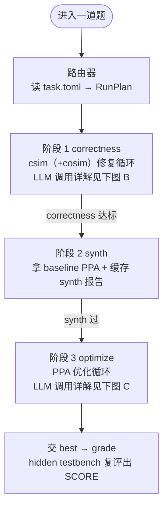
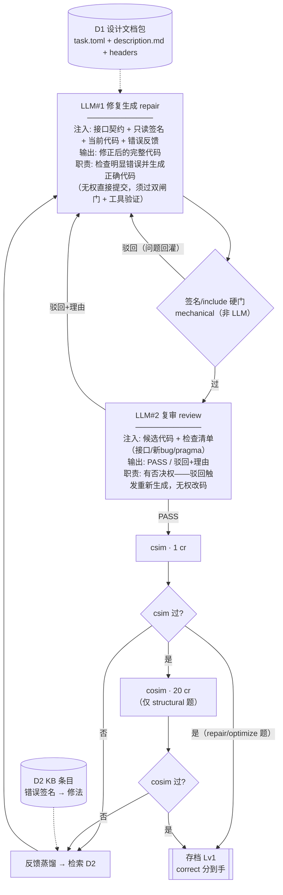
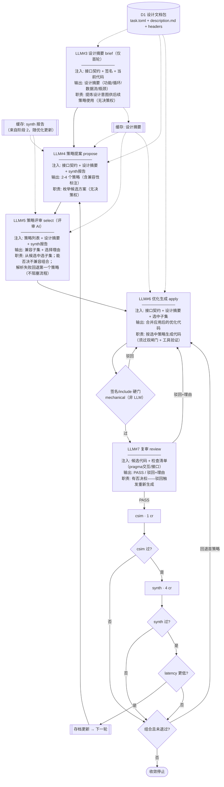
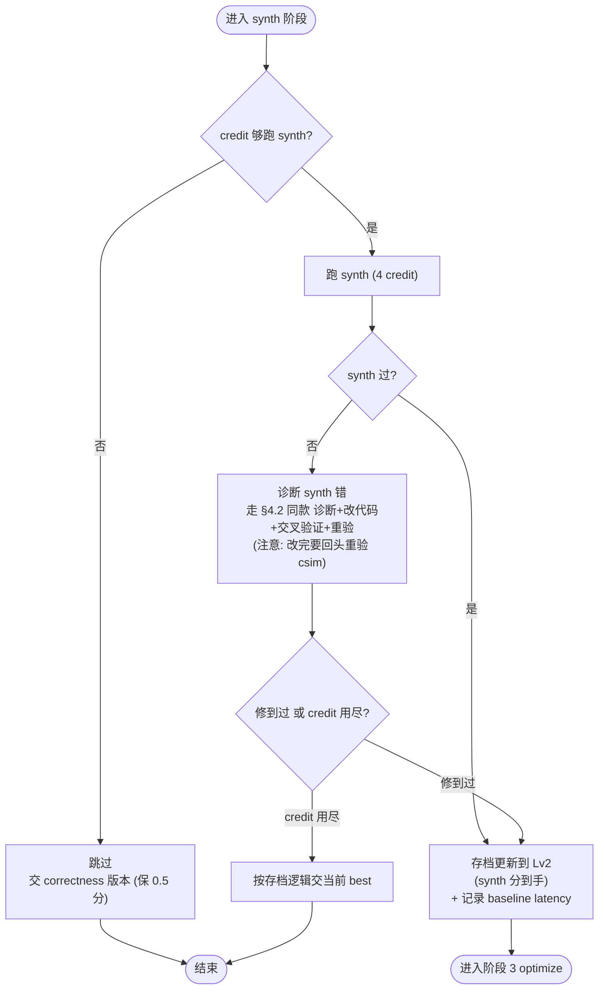
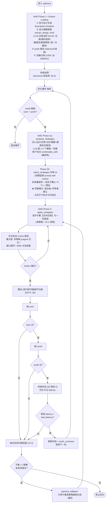
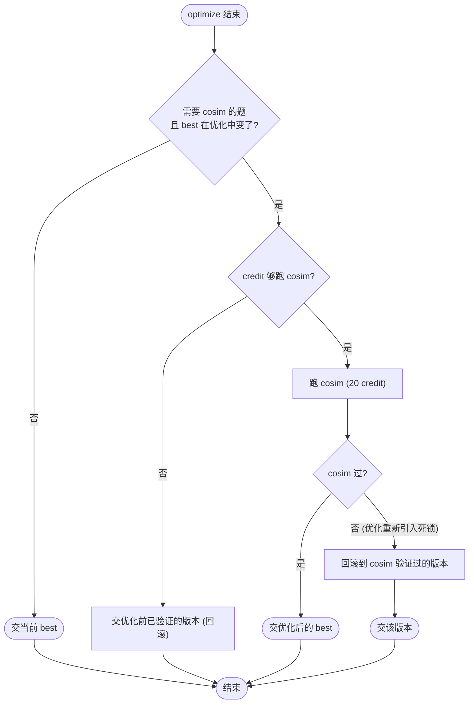

# Agent 架构设计 (Agent Architecture)

> 状态：草案 v2.6（2026-07-19）
> 阶段：P2 启动前的架构定稿
> 依据：官方 harness（contest/fpt26-harness/）+ AMD LLM4HLS SHA-256 案例文章 + 本仓库 dev-log 2026-07-11-03
>
> **迭代策略（v2 明确）**：第一次迭代只追"用最少编译拿到最高正确性"，**暂不考虑 token 成本**——Agent 交叉验证保留，token 优化等系统跑稳后再做（第二次迭代起）。

本文档定义 agent 的整体架构。所有后续编码（agent/ 目录）以本文档为准。

---

## 0. 设计原则

1. **fork 官方 harness，原地改。** 复用 `ToolServer` / `Budget` / `Task` / `report.py` / `vitis.py` / `scoring.py`，只重写 `agent.py`（主循环）并新增知识库模块。理由：评估接口已被官方锁死为进程内函数调用，重造无收益。
2. **单进程，不做 RPC/多进程。** 官方 `ToolServer` 已用 subprocess 跑 vitis，工具崩了不会拖垮 agent。隔离性已满足。
3. **线性流程 + 回溯重验。** 主流程是线性的（correct → synth → optimize），但每次改代码后必须回头重验已通过的关卡，因为改一处可能破坏另一处。
4. **存档模式（checkpoint）。** 只在"关卡数单调不减、同关卡内 latency 更低"时更新存档。提交的是最新存档，不是最后一次改的版本。
5. **第一次迭代：只追正确性，暂不考虑 token。** 目标是"用最少编译拿到最高正确性"。Agent 交叉验证保留（提高一次过率）。token 优化是系统跑稳之后（第二次迭代起）才考虑的问题。
6. **correctness 优先于 PPA。** 评分公式决定了 correct 是 0.5 的硬门槛，synth+PPA 合计 0.5。先保 0.5，再冲 0.5。
7. **Agent 交叉验证。** 在关键决策点（修改方案确定、优化策略选定）由另一个 Agent（或同模型换 prompt 的 self-check）做 review，提高一次过率、减少无效重试。第一次迭代暂不计 token 成本。

---

## 1. 评估模型（设计地基）

agent 的每一个设计决策都建立在对评估模型的理解上。

### 1.1 三个关卡（csim / synth / cosim）

| 关卡 | 代价 | 本质 | 验什么 | 看不见什么 |
|---|---|---|---|---|
| **csim** | 1 credit | 纯软件跑 C++（g++ 编译 + testbench） | 算法逻辑对不对 | 硬件（stream 当无界 FIFO，pragma 当注释） |
| **synth** | 4 credits | 把 C++ 翻译成 RTL 电路，静态分析 | 能不能成电路；产出 latency/II/资源报告 | 运行时行为（死锁看不见） |
| **cosim** | 20 credits | 真模拟电路跑起来，stream 是深度 2 的真 FIFO | 硬件运行时对不对（死锁、时序、RTL/C 不一致） | — |

**精度递增、代价递增。** 一道关卡在前一关挂了，没必要进下一关。但反过来：改代码修后面的 bug，可能破坏前面已通过的关卡。

### 1.2 两套独立预算

| | credit | token |
|---|---|---|
| 是什么 | 工具调用次数（csim/synth/cosim） | LLM 调用消耗的字数 |
| 限制性质 | **硬限制**：超了 `BudgetExceeded` 抛异常停 | **软限制**：影响评分但不停 |
| 花光后 | 无法再调工具 | 仍可调用，但扣分 |
| 省下有奖励吗 | **没有**（单题内不累积，分数只看达到哪关） | **有**（token 是终评指标，用得少分高） |

**关键结论（来自讨论）：**
- credit 维度上，"线性走哪算哪、失败重试、用光就停"与任何"聪明止损"策略拿到相同分数。省 credit 没有价值。
- 真正需要"权衡"的是 token 维度——不要在没希望的重复重试上烧 LLM 调用。agent 的智能应聚焦于"让每步更可能一次过"（减少重试次数），而非"决定何时停止"。

### 1.3 评分公式（scoring.py:144-149）

```python
if not functional_pass:                    # hidden testbench 没过
    score = 0.0
else:
    ppa_norm = min(acceleration, 8) / 8    # PPA 归一化，上限 8 倍加速
    quality = 0.5 * correct + 0.2 * synth_pass + 0.3 * ppa_norm
    score = difficulty * quality
```

其中 `functional_pass = hidden_csim.ok and (cosim_pass is not False)`。

**分层结构：**
- **correct（0.5 权重）**：csim 过 + cosim 过（若 requires_cosim）。这是硬门槛，不过直接 0 分。
- **synth（0.2 权重）**：能综合成电路。
- **PPA（0.3 权重）**：candidate latency 相对 baseline 的加速比。

**注意：评分用 hidden testbench，在 agent budget 之外运行。** agent 开发时用 public testbench，评分时用 hidden testbench。agent 开发时跳过某关卡不省分，评分照样验。

### 1.4 task_type 与关卡需求

harness 的 `task_type` 字段决定这道题的 bug 藏在哪一关、correctness 需要过哪几关：

| task_type | 典型初始状态 | correctness 关卡 | 说明 |
|---|---|---|---|
| **repair** | csim 不过（功能 bug） | csim | 算法错，csim 直接抓到 |
| **optimize** | csim 过，只是慢 | csim | 代码没 bug，冲 PPA |
| **structural** | csim 过，cosim 不过 | **csim + cosim** | 死锁/流式 bug，只有 cosim 抓得到 |
| **generate** | 从起始代码生成 | csim（+cosim 视情况） | 从头写 |

---

## 2. 存档逻辑（Checkpoint）

这是 agent 主循环的核心数据结构。所有改代码的尝试都经过存档判定。

### 2.1 关卡完成度定义

一个代码版本 V 的"关卡完成度"是一个有序元组：

```
level(V) = (csim_pass, cosim_pass_if_required, synth_pass)
```

字典序比较：csim 过 > cosim 过 > synth 过。

更直观地，把完成度映射成 0-4 的等级（越高越好）：

```
Lv0: 啥都没过                      → 0 分
Lv1: csim 过（且 cosim 过 if needed） → correct 分到手（0.5×diff）
Lv2: Lv1 + synth 过                 → 再加 synth 分（+0.2×diff）
Lv3: Lv2 + 有 latency 数据          → 可参与 PPA 比较
Lv4: Lv3 + latency 比 baseline 好   → PPA 分（+0.3×diff）
```

### 2.2 存档判定规则

设当前存档为 B（best），新尝试为 C（candidate）。按优先级判定：

1. **C 的关卡等级 > B** → 无条件存档（C 成为新 best）。
2. **C 的关卡等级 == B** → 比较 latency：C 更快才存档；否则丢弃 C。
3. **C 的关卡等级 < B** → 绝不存档（correctness 倒退），丢弃 C，B 不动。

**核心：存档只能向前走（关卡单调不减），同关卡内择优（latency 更低）。**

### 2.3 速度数据的来源

- csim **不返回 latency**（纯软件跑，无时钟周期概念）。
- synth 返回 latency（csynth.xml 解析出的 latency_worst / latency_avg）。
- cosim 返回 measured latency（实测的，更准）。

**所以"比速度"只有在 Lv2 以上（synth 过）才有意义。** Lv0/Lv1 之间只能比关卡数。

### 2.4 初始存档

进入一道题时，初始存档 = 原始 kernel 代码。其 level 取决于 task_type：

| task_type | 初始代码 level |
|---|---|
| optimize | 通常 Lv1（csim 已过） |
| structural | Lv0（cosim 不过 = correct 没达标）|
| repair | Lv0（csim 本身不过） |
| generate | 取决于起始代码 |

**repair/structural 题的第一个有分存档，要等 csim/cosim 首次修过才产生。** 这是这些题的保底。

### 2.5 存档自带回滚

改代码修高级 bug 时如果破坏了低级关卡，失败版本不会进存档，best 停留在之前通过的版本——自动回滚。无需额外回滚逻辑。

---

## 3. 路由器（Router）

路由器在一道题进入时运行一次，决定后续走哪条路径。

### 3.1 路由器输入

- `task.toml` 的 `task_type` 字段（**免费读取，不花 credit**）
- `task.toml` 的 `requires_cosim` 字段
- `description.md`（官方提供的接口契约 + 初始状态描述）
- 原始 kernel 代码

### 3.2 路由器不做的事

- ❌ 不判断"C 还是 HLS"（输入永远是 HLS C++，header 已锁死签名）
- ❌ 不"跳过低级关卡"（评分照样验，跳过无收益且有风险——改高级 bug 可能破坏低级正确性，必须重验）
- ❌ 不跑工具做诊断（省 credit 无意义，但这里连 credit 都不该花——task.toml 是免费信息）

### 3.3 路由器做的事

路由器根据 task_type 选择主循环的"关卡路径"：

| task_type | 关卡路径 | 说明 |
|---|---|---|
| **repair** | csim 修复循环 → synth → optimize | bug 在 csim 暴露，修到 csim 过后进 synth |
| **optimize** | （csim 确认）→ synth 拿 baseline → optimize 循环 | 代码本就对，先 csim 确认 1 credit（廉价保险），再冲 PPA |
| **structural** | csim 确认 → **cosim 修复循环** → synth → optimize | 死锁只在 cosim 暴露，correctness 必须含 cosim |
| **generate** | csim 修复循环 →（cosim 若需）→ synth → optimize | 从头写，大概率 csim 先挂 |

**路径差异只在"correctness 需要过哪几关"：** repair/optimize 只 csim，structural 要 csim+cosim。其余（synth → optimize）所有类型一致。

### 3.4 路由器输出

路由器产出一份 RunPlan，传给主循环，包含四个字段：
- **task_type**：题目类型（repair/optimize/structural/generate）
- **correctness_stages**：correctness 需要过的关卡（如 [csim] 或 [csim, cosim]）
- **needs_optimize**：是否进入 PPA 优化阶段
- **initial_level**：初始存档的关卡等级（用于存档判定起点）

---

## 4. 主循环（Main Loop）

主循环是线性流程 + 回溯重验 + 存档判定。以下用 Mermaid 流程图体现核心结构（控制流含分支与回退，用 flowchart 而非放射状 mindmap 表达）。

### 4.0 全流程总览（LLM 调用标注法 v2）

§4.1-§4.5 是控制流细节图。本节是全流程总览，用一套**标注画法**让路人也能一眼看清：流程怎么走、每次 LLM 调用注入了什么（信息从哪来，**虚线箭头直接连过来**）、输出什么、有什么权力。

**画法规范（v2，4 条）：**

1. **节点分型**：矩形 = LLM 调用（四行卡，见规范 2）或工具调用（标 credit 成本）；圆柱 = 数据源（编号 D1-Dn）；子程序形 = 存档/缓存；菱形 = 判定/硬门；体育场形 = 起止。
2. **LLM 调用矩形卡固定四行**：`LLM#n 名称` / `注入: 注入了什么` / `输出: 产物（review 类必须写明 PASS / 驳回+理由）` / `职责: 一句人话写清权力边界`——职责不写抽象单词，写清"做什么 + 有无否决权 + 失败怎么办"，例如"检查明显错误并生成正确代码（无权直接提交，须过双闸门+工具验证）"。
3. **数据流画虚线箭头**：注入来源（数据源 / 缓存 / 上游产物）用虚线连到消费它的 LLM 节点；实线只走控制流。为可读性，**数据源就近放在消费它的阶段图内**，不画跨阶段长虚线——所以全览图按阶段拆为三张（骨架 + correctness + optimize），而非一张大图。
4. **review 双闸门必须完整展开**：mechanical（签名/include 硬门，非 LLM）画菱形即可；LLM review 必须画矩形四行卡，且两条出边显式标注——`驳回+理由 → 回生成节点`、`PASS → 下一关"。

**职责权限词汇表**（职责行里的关键词统一用这套）：

| 词汇 | 含义 | 例子 |
|---|---|---|
| **生成** | 只产出内容，无决策权 | repair / apply_strategies / extract_design_brief / propose_strategies |
| **选择** | 从候选中挑选，解析失败有确定性回退 | select_strategies（回退第一个策略） |
| **可驳回** | reject 触发重新生成，无权直接改代码 | LLM review |
| **硬门** | 确定性规则拦截，不过即驳回（非 LLM） | mechanical_review（签名/include） |
| **仲裁** | 决定什么进存档 best（非 LLM） | checkpoint 三条规则 |

#### 图 A：全流程骨架（三阶段 + 提交）



#### 图 B：correctness 阶段（LLM 调用详解）



注：首轮进入时 LLM#1 先做一次"静态体检"（不花 credit 的免费审查，直接看原始代码找明显 bug），跑通 residual 题时它一次性修掉了死锁模式，省下一次 20 cr 的失败 cosim + 15 分钟超时。

#### 图 C：optimize 阶段（LLM 调用详解）



**读图示例**（回答"review 只负责选还是有驳回权"这类问题）：两种评审角色一目了然——`LLM#2/#7 复审 review` 职责行写明"**有否决权**——驳回触发重新生成"，出边有两条（驳回回生成节点 / PASS 进工具验证）；`LLM#5 策略评审 select` 职责行写明"**从候选中选子集**；能否决不兼容组合；解析失败回退第一个策略（不阻塞流程）"——它能否决提出者的兼容性声明，但自身失败时不阻塞流程。

### 4.1 总体流程


### 4.2 阶段 1：correctness（修复循环）

目标：让代码通过 correctness 所需的所有关卡（repair/optimize 题 = csim；structural 题 = csim + cosim）。


**要点：**
- 每轮失败不更新存档 level——best 停在最后一个通过版本，失败候选自动回滚。
- 交叉验证是 v2 加的，第一次迭代不计 token 成本，旨在提高一次过率、减少无效重试。
- 知识库命中可能同时提供"修法说明"和"成熟修改示例"（见 §6.4）。

### 4.3 阶段 2：synth（拿 baseline PPA）

目标：验证可综合性 + 拿到 baseline latency 数据（synth 分 0.2 + 为优化提供基准）。



**要点：** synth 不过时也走修复循环（RAG 检索 synth 类修法 + 交叉验证），但每次改完要回头重验 csim（改 synth 可能破坏 correctness，见 §5）。

**修复循环细化（v2.3）：**
- 每轮顺序：synth 失败反馈 → `build_feedback` 提取错误签名（XFORM/RTGEN 错误码 + 关键词）→ KB 检索 → `repair`（注入接口契约 + 反馈 + KB 命中）→ 双层 review → **先重验 csim**（1 credit，便宜）→ csim 过才再跑 synth（4 credits）。
- 重验 csim 不过：该候选带回 csim 反馈进入下一轮修复（不浪费 4 credits 去 synth 一个已破坏正确性的版本）。
- 轮数上限 `max_synth_rounds = 3`：每轮最坏花 csim 1 + synth 4 = 5 credits，3 轮 15 credits，配合 budget 检查（`can_afford`）双保险。修到过或 credit/轮数尽为止；尽则按存档逻辑交当前 best（保 correctness 分）。
- synth 通过后记录 `synth_summary`（latency/II/资源一行摘要），供 §4.4 优化阶段注入。
- **latency 无效值防御**：解析出的 latency 为 None 或 ≤0 时视为无效数据（真机出现过 synth 过了但 latency=0 的解析异常），不参与存档比较，防止"0 周期"被误判为最快。

### 4.4 阶段 3：optimize（PPA 优化循环）

目标：在 correctness + synth 都过的前提下，降 latency 冲 PPA 分（0.3 权重）。



**要点：**
- **优化必须先提取设计文档再改进（v2.3 明确）**：AMD Phase 1 Context Loading 三件套缺一不可——① 官方设计文档（task.description 接口契约 + headers，防优化破坏接口）；② 设计摘要提取（`extract_design_brief`：LLM 先从当前 kernel 提取功能/循环结构/数据流/瓶颈猜想，优化循环开始前做一次并缓存，后续每轮注入）；③ synth 报告（latency/II/资源）。AMD 核心经验："不给综合数据，LLM 只能给泛泛建议"——同理，不给设计意图，LLM 给的策略不贴代码实际。
- **策略组合 + 评审 AI（v2.4，替代 v2.3 的"取首策略"启发式）**：策略不再单选。提出者在 `propose_strategies` 里给每个策略标注 `combinable_with`（与哪些策略互不干扰）；评审 AI `select_strategies`（同模型换 prompt self-check，§11 既定形式）复核兼容性并选出子集。**双重确认规则：提出者和评审者都认为互不干扰，代码 AI 才把多个策略合并应用到一份候选**（pragma 类优化天然可组合——PIPELINE 内层 + ARRAY_PARTITION 数组 + DATAFLOW 顶层——一次验证试多个策略，credit 效率最高）。
- **失败回退做组合归因（v2.4）**：组合候选失败（csim 挂/synth 挂/无改进）时，无法知道是哪个策略导致的——回退到子集首策略单独重新生成+重验一次；仍失败才停止优化。每轮最多 2 个候选验证（10 credits）。
- **轮数上限 `max_optimize_rounds = 4`（v2.3 定）**：每轮最坏花 2×(csim 1 + synth 4) = 10 credits。以 dotProduct（budget=40）为例：correctness ~2 + synth 4，剩 ~34，4 轮留有余量；`can_afford` 检查自然截断。
- **停止条件（任一命中）**：单策略候选也无改进 / 回退后仍失败 / credit 不够跑 csim+synth / 达到轮数上限。
- 优化改代码后必重验 csim（+ cosim if structural）——pragma 改动是 AMD 点名的 LLM 高错点；组合候选的 pragma 交互风险更高，review focus 必须点名多策略交互。
- synth 通过的新报告同时更新缓存的 `synth_summary`，下一轮策略探索基于最新数据。

### 4.5 结构性题的优化后回验

structural 题优化阶段改了代码后，必须额外重验 cosim——优化可能重新引入死锁（ReferenceAgent agent.py:198-209 正是这么做的）：



**回滚语义（v2.3 明确，修实现 bug）**：进入 optimize 时对存档（code/level/latency/cosim_ok）做**快照**。回滚 = 把存档整体恢复快照，不是只记一条日志——曾出现过 cosim 回验失败却只写 rollback 事件、最终提交仍带死锁的实现 bug。触发回验的两个前提（对应 Q1）：① 本题 correctness 含 cosim 关卡（`"cosim" in correctness_stages`，比判 task_type 字符串更语义化）；② best 相对快照变过（没变说明优化无产出，无需再花 20 credits）。credit 不够回验时同样回滚到快照（交已验证版本，不赌）。

---

## 5. 修改的连锁影响（为什么必须回溯重验）

这是整个架构的关键洞察：**改代码修一个关卡的 bug，可能破坏另一个已通过的关卡。**

| 改什么 | 可能破坏什么 |
|---|---|
| 修 cosim 死锁（重构 dataflow） | csim 逻辑（重构时引入算法错） |
| 修 synth 错（改 pragma/结构） | csim 逻辑 + cosim 死锁 |
| optimize（加 pragma 降 latency） | csim 逻辑 + cosim 死锁（AMD 文章点名的 LLM 短板） |

**因此主循环的每次改代码后，都要重验 correctness 关卡。** 存档机制保证了"验不过就回滚"——失败版本不进 best。

---

## 6. RAG 知识库（调试增强）

知识库是 agent 相对官方 ReferenceAgent 的核心增值，覆盖 AMD 文章点名的 LLM 短板。

### 6.1 知识库定位

- **形态**：结构化数据（JSON/YAML）+ 关键词/错误码匹配，不是 wiki/搜索引擎。
- **检索时机**：仅在修复阶段解析到特定错误签名时注入，正常时不注入（省 token）。
- **每条结构**：`error_code + symptom + root_cause + fix_pattern + example`

### 6.2 知识库覆盖范围（分阶段）

| 阶段 | 覆盖内容 | 来源 |
|---|---|---|
| P2（correctness） | 编译错 + csim 功能 bug + cosim 死锁/流式 | HLS Repair 论文 + AMD 案例 |
| P3（扩 cosim） | DATAFLOW 死锁、AXI-Stream 握手（TLAST/TREADY/TVALID）、ap_ctrl 时序 | 队友整理 |
| P4（PPA） | pipeline/unroll/array_partition/dataflow/bind_op 何时用 | PPA 优化速查 |

### 6.3 检索方式（两类，分阶段实现）

**第一类：错误签名匹配（第一次迭代，P2 必做）**

- 字符串匹配错误码（如 `[XFORM 203-313]`）+ 关键词匹配（如 "deadlock" "FIFO"）。
- 命中后注入：错误码修法 + 根因 + 修法说明。
- 量大了再考虑 embedding。先简单。

### 6.4 功能 pattern / 成熟修改示例检索（第二次迭代，可选）

用户洞察：除了"按错误码找修法"，还可以"按代码功能 pattern 找成熟修改示例"。例如 agent 看到 kernel 里有一个 `for` 循环累加，知识库直接匹配到"for 循环累加 → 加 PIPELINE pragma 的标准改法（含前后对照示例）"，LLM 照着改即可，不必从零推理。

**检索逻辑：**
- 在错误签名匹配（§6.3）之外，额外对当前 kernel 做功能 pattern 识别（如：顺序累加循环 / 嵌套循环 / 数组访问 / stream 读写顺序）。
- 命中后注入：成熟修改示例（before/after 代码对照）+ 适用条件 + 注意事项。
- 相当于给 LLM 一个"标准答案片段"，降低推理难度、提高一次过率。

**示例条目形态：**
- 功能 pattern 标签：`sequential_accumulation_loop`
- 适用场景：单层 for 循环对数组做累加，无依赖
- 成熟修改示例：
  - before：`for (i) result += a[i]*b[i];`
  - after：`for (i) { #pragma HLS PIPELINE result += a[i]*b[i]; }` + 配套 ARRAY_PARTITION
- 注意事项：partition 不足会导致 II>1

**实现复杂度评估：** 功能 pattern 识别比错误码匹配难——需要先对 kernel 代码做结构化抽象（识别出"这是个累加循环"），再做 pattern 匹配。用户判断这点实现起来可能困难，**第一次迭代不做，留到第二次迭代**。先靠错误签名匹配 + LLM 自身能力跑通闭环，稳定后再加。

---

## 7. 与 AMD 四阶段工作流的映射

| AMD 阶段 | 我们的实现 | 所在模块 |
|---|---|---|
| **Phase 1: Context Loading**（源码 + 综合报告 + 设备约束） | 修复阶段注入 task.description + header；优化阶段注入设计文档 + 设计摘要 + synth 报告（§4.4） | reach_correctness / optimize |
| **Phase 2: Strategy Exploration**（提多个策略 + 权衡再选） | optimize 阶段的 `llm.propose_strategies`（带兼容性标注）+ `llm.select_strategies` 评审 AI 双重确认选子集 | optimize |
| **Phase 3: Code Generation** | `llm.repair` / `llm.apply_strategies`（组合子集合并应用） | reach_correctness / optimize |
| **Phase 4: Validation**（综合 + 仿真 + 反馈循环） | csim/synth/cosim 重验 + 存档判定 | 主循环全程 |

---

## 8. LLM 调用层（待 P2 细化）

### 8.1 接口

复用 harness 的 `LLMClient` Protocol（`complete(system, user) -> str`），在其上封装领域专用方法：
- **repair**：给定任务、当前代码、工具反馈、知识库命中 → 返回修复后的候选代码（或失败）。
- **review**：交叉验证候选（接口不变 / 无新 bug / pragma 冲突）。
- **extract_design_brief**（v2.3 新增）：给定任务、当前代码 → 返回设计摘要文本（功能 / 循环结构 / 数据流 / 瓶颈猜想）。optimize 循环开始前调一次并缓存（§4.4 Phase 1）。
- **propose_strategies**：给定任务、当前代码、综合报告、设计摘要 → 返回多个优化策略（含收益/资源/风险权衡 + `combinable_with` 兼容性标注，v2.4）。
- **select_strategies**（v2.4 新增）：评审 AI（同模型换 prompt self-check）。给定任务、策略列表、综合报告、设计摘要 → 复核兼容性，返回选中策略索引子集（1~N 个）+ 一句话理由。解析失败/空集时回退 [0]（第一个策略）。
- **apply_strategies**：给定任务、当前代码、选定策略子集 → 返回把子集**合并应用**后的候选代码（或失败）。单策略是 N=1 特例。

**prompt 内容硬要求（v2.3 明确）**：所有改代码类方法（repair / propose_strategies / apply_strategy）的 user prompt 必须注入 ① task.description（官方设计文档/接口契约）② headers（只读签名）——optimize 类方法另加 ③ synth 报告摘要 ④ 设计摘要。缺失 ①② 会导致 LLM 给出脱离接口契约的泛泛建议（AMD Phase 1 教训）。

### 8.2 模型选择

赛题要求开源模型，推荐三选一对比：
- DeepSeek V4 Pro（1.6T MoE，100 万上下文）
- Qwen3.5 122B A10B（AWQ 4bit）
- Qwen3.6 27B（Dense，262K 上下文）

开发期可用环境内置 GLM 调试，生产切目标模型。

### 8.3 输出解析

要求 LLM 返回 fenced code block（```cpp ... ```），复用 ReferenceAgent 的 `_extract_code` 正则。

---

## 9. 模块划分（agent/ 目录结构）

```
agent/
  __init__.py
  router.py          路由器：task_type → RunPlan
  checkpoint.py      存档逻辑：level 比较 + 存档判定（§2）
  main_loop.py       主循环：run() + reach_correctness + optimize（§4）
  llm_client.py      LLM 调用封装：repair/propose_strategies/apply_strategy（§8）
  feedback.py        反馈构建：从 ToolResult 构建 LLM 友好的 feedback 文本
  knowledge_base/    RAG 知识库（§6）
    __init__.py
    retriever.py     检索器（关键词/错误码匹配）+ KBEntry schema
    entries.py       种子条目数据（seed_entries()，v2.3；后续可扩为 entries/ YAML）

contest/fpt26-harness/llm4hls/   ← 官方 harness，fork 后原地改
  agent.py           ← 替换为我们的 main_loop（或保留参考版做对比）
  (其余文件复用)
```

---

## 10. 不做的事（明确排除）

- ❌ 多进程/RPC 架构（官方 ToolServer 已是进程内函数调用）
- ❌ "跳过低级关卡"的路由策略（评分照样验，且改代码会破坏已通过关卡）
- ❌ "白盒检查 + 逻辑推演"作为主要验证手段（靠 csim/synth/cosim 跑，不靠 LLM 想）
- ❌ "错误≥3 就重写"的规则（credit 约束下重写易破产；修改式优先）
- ❌ 完整详细设计文档（单函数 kernel 无需函数间耦合分析；header + description.md 已是官方设计文档）
- ❌ 第一次迭代做 token 优化（第一次只追正确性；token 优化是系统跑稳后第二次迭代起的事）
- ❌ 第一次迭代做功能 pattern 检索（实现复杂度高；先靠错误签名匹配跑通闭环）
- ❌ 第一次迭代做 WebUI（用结构化日志 + tail -f 足够；数据源可复用，见 §12）

---

## 11. 待细化（P2 编码时确定）

- [x] 各阶段 prompt 模板（system prompt + user prompt 结构）—— v2.3 定：见 §8.1 硬要求 + llm_client.py 模块级模板
- [x] 知识库条目 schema 的字段精确定义—— 已定：KBEntry（id/symptom/root_cause/fix/example/signatures），见 retriever.py
- [x] max_rounds / max_optimize_rounds 的默认值—— v2.3 定：max_rounds=6（参考 ReferenceAgent）、max_synth_rounds=3、max_optimize_rounds=4，依据见 §4.3/§4.4
- [x] Strategy Exploration 的"选哪个策略"策略—— v2.3 定：固定启发式取第一个，每轮重新 propose（§4.4）
- [x] 交叉验证的具体形式（独立 agent vs 同模型换 prompt self-check）及触发时机—— 第一次迭代用同模型换 prompt self-check（代码 review 闸门 + v2.4 策略评审 select_strategies 两处）；异模型独立评审留第二次迭代
- [ ] token 计数埋点（第一次迭代不优化，但埋点先做好，供第二次迭代分析）—— **第二次迭代**
- [ ] 功能 pattern 检索的代码结构抽象方法 —— **第二次迭代**
- [ ] 与官方 ReferenceAgent 的 A/B 对比评测方案

---

## 12. 可观测性（Observability）

agent 跑一道题可能持续数分钟到数十分钟（cosim 单次最长 15 分钟）。全黑盒运行无法判断"在哪一步、是否卡死、为何没进展"。本节定义日志、审计、活跃度监控、超时分层。

### 12.1 日志层级

三层日志，各司其职：

| 层 | 载体 | 记什么 | 谁消费 |
|---|---|---|---|
| **审计层** | harness transcript（已有） | 每次工具调用：序号、kind、phase、spent credit、brief | 事后复盘、评测报告、token 分析 |
| **结构化日志** | stdout + JSONL 文件（新增） | agent 每个决策点的语义事件（见 §12.2） | 实时观察（tail -f）、事后分析 |
| **活跃度心跳** | 单独的 heartbeat 行/文件（新增） | 距上次活动秒数、当前阶段、credit 余量 | 卡死检测 |

### 12.2 结构化日志点（agent 主循环必记）

在以下决策点写结构化日志（JSONL，每行一条，便于事后 grep/jq 分析）：

| 节点 | 日志事件 | 关键字段 |
|---|---|---|
| 路由决策 | `route` | task_id, task_type, correctness_stages, initial_level, budget |
| csim 调用前后 | `tool_call` / `tool_result` | kind=csim, phase(pass/fail/compile_error...), rc, elapsed_s, credit_spent |
| synth 调用前后 | 同上 | kind=synth, + latency/II/资源（若过） |
| cosim 调用前后 | 同上 | kind=cosim, + deadlock/rtl_mismatch 标志 |
| RAG 检索 | `kb_search` | query(错误签名/关键词), hits(命中条目数), hit_ids |
| LLM 调用 | `llm_call` | purpose(repair/strategy/apply/review), model, prompt_tokens, completion_tokens |
| 交叉验证 | `review` | reviewer, verdict(pass/reject), issues(挑出的问题), retry_count |
| 存档变更 | `checkpoint` | old_level, new_level, old_latency, new_latency, reason |
| 阶段切换 | `phase_enter` / `phase_exit` | phase(correctness/synth/optimize), best_level, credit_remaining |
| 预算耗尽 | `budget_exhausted` | spent/total, last_best_level, last_attempt |
| 提交 | `submit` | final_level, final_latency, total_credit, total_llm_calls |

### 12.3 活跃度心跳（卡死检测）

每 N 秒（建议 10s）写一条心跳，含：
- `age_s`：距上一次有意义活动（工具调用完成 / LLM 返回 / 存档变更）的秒数
- `current_stage`：当前所处阶段（correctness / synth / optimize / 等待 csim / 等待 LLM ...）
- `credit_remaining`：剩余 credit
- `llm_calls`：累计 LLM 调用次数

**卡死判定**：心跳 `age_s` 超过阈值时标记为 `STALE`。阈值按当前在等什么区分：
- 等 csim：合理上限 180s（harness 已有 SIGKILL 超时）
- 等 synth：合理上限 600s
- 等 cosim：合理上限 900s
- 等 LLM：合理上限 180s（OpenRouterClient 已有此 timeout）
- **若 age_s 超过对应阈值仍在 STALE，说明超时机制可能未生效，需人工介入**

**观测方式**：第一次迭代用 `tail -f heartbeat.jsonl` 实时看，STALE 行用醒目前缀。第二次迭代起可升级为 TUI/WebUI 消费同一数据源。

### 12.4 超时分层（双重保障）

| 层 | 机制 | 已有/新增 | 防什么 |
|---|---|---|---|
| **工具超时** | csim 180s / synth 600s / cosim 900s，超时 SIGKILL 整个进程组 | ✅ harness 已有（vitis.py:63-69） | vitis/RTL 仿真挂死、死锁 |
| **LLM 调用超时** | 180s，超时抛异常 | ✅ harness 已有（llm.py:89） | OpenRouter 不返回 |
| **活跃度告警** | 心跳 age_s 超阈值标 STALE | 🆕 新增 | 上述超时失效时的兜底（如 subprocess 泄漏、网络静默） |

前两层是硬超时（直接 kill/抛异常），第三层是软告警（标记但不自动处理，留给人或后续自动重试逻辑）。

### 12.5 与 transcript 的关系

- **transcript（harness）**：只记工具调用，权威、不可篡改，用于评测审计和最终评分报告。
- **结构化日志（新增）**：记 agent 决策语义（路由、RAG、review、存档），transcript 不含这些。
- **两者通过 `task_id` + 工具调用序号关联**，事后可 join 起来重建完整运行轨迹。

### 12.6 不做的事（第一次迭代）

- ❌ WebUI（3-5 天开发量，第一次迭代用结构化日志 + tail -f 足够；数据源设计成可复用，第二次迭代升级面板时直接消费 JSONL）。
- ❌ 自动卡死恢复（第一次迭代 STALE 只告警，人工判断；自动重试逻辑留待经验积累后）。

---

## 变更记录

| 日期 | 变更 | 变更人 |
|---|---|---|
| 2026-07-19 | v2.6。§4.0 按用户反馈重做（标注法 v1→v2）：① 注入来源从"卡内编号注释"改为**虚线箭头真实连接**（数据源/缓存就近放在消费它的阶段图内，不画跨阶段长虚线）；② 全览图从一张大图拆为三张（图 A 三阶段骨架 / 图 B correctness 详解 / 图 C optimize 详解），布局可读性优先；③ 职责行从抽象单词改为一句人话（如 repair="检查明显错误并生成正确代码（无权直接提交，须过双闸门+工具验证）"）；④ review 双闸门完整展开——mechanical 画菱形（非 LLM 硬门），LLM review 画矩形四行卡，出边显式标"驳回+理由→回生成节点 / PASS→下一关"；⑤ "pre-csim 免费审查"正名为 LLM#1 修复生成（首轮=静态体检，附 residual 实例注）。三张图均经 mermaid-cli 渲染验证。 | Agent 主 |
| 2026-07-18 | v2.4。§4.4 Phase 2/3 重写（用户三决策）：① 策略从"取首策略"改为**组合子集**——propose 时逐策略标注 `combinable_with`，新增评审 AI `select_strategies`（同模型换 prompt self-check）复核兼容性并选子集，**双重确认（提出者+评审者都认互不干扰）才允许组合**，`apply_strategies` 把子集合并应用为一份候选；② 失败回退做组合归因：组合候选失败/无改进 → 回退子集首策略单试一次 → 仍失败才停（每轮最多 2 候选 10 credits）；③ review focus 加"多策略 pragma 交互"。§7 映射表、§8.1 接口（select_strategies 新增、apply_strategies 多策略签名）、§11 交叉验证形式补注同步。 | Agent 主 |
| 2026-07-18 | v2.3。按实现差距补齐四处：① §4.3 synth 修复循环细化（每轮先重验 csim 再 synth、max_synth_rounds=3、latency 无效值防御）；② §4.4 optimize 循环细化（Phase 1 Context Loading 三件套：官方设计文档+extract_design_brief 设计摘要+synth 报告；取首策略启发式；max_optimize_rounds=4；停止条件）；③ §4.5 回滚语义明确（快照整体恢复，修"只记日志不真回滚"的实现 bug；回验前提改为"cosim in correctness_stages 且 best 变过"）；④ §8.1 prompt 硬要求（改代码类方法必注 description+headers）+ extract_design_brief 接口。§7 映射表、§9 模块划分（entries.py）、§11 待细化四项销项同步更新。 | Agent 主 |
| 2026-07-14 | v2.2。三处：① 修 §4.1 总览图存档逻辑（correctness/synth 达标后显式加存档更新节点 Ckpt1/Ckpt2 + synth 失败止损分支）；② 新增 §12 可观测性（三层日志：transcript/结构化JSONL/心跳；12 个日志点；活跃度 STALE 告警；双层超时 + 兜底；与 transcript 关联）；③ 定可观测方案——第一次迭代用结构化日志 + tail -f，不做 WebUI（数据源可复用，第二次迭代升级）。 | Agent 主 |
| 2026-07-14 | v2.1。按用户反馈将 §4 主循环全部改为 Mermaid 流程图（5 张：总体流程 + correctness 修复循环 + synth + optimize + structural 回验），替换原 ASCII 字符画。控制流含分支与回退，用 flowchart 而非放射状 mindmap。 | Agent 主 |
| 2026-07-14 | v2。按用户反馈三处修改：① §4 主循环全部改为思维导图，移除所有代码块（§2.2/§3.4/§8.1 同步去代码化）；② 明确第一次迭代只追正确性、暂不考虑 token，Agent 交叉验证保留（新增设计原则 5/7，§4.2/§4.4 加入交叉验证节点）；③ §6 扩展知识库检索为两类——错误签名匹配（第一次迭代）+ 功能 pattern/成熟修改示例（第二次迭代，§6.4）。 | Agent 主 |
| 2026-07-14 | v1 初稿。基于 harness 解压发现 + 与用户深度讨论（三关卡模型、评分公式、credit vs token、线性流程正确性、存档逻辑、修改连锁影响）定稿。 | Agent 主 |
