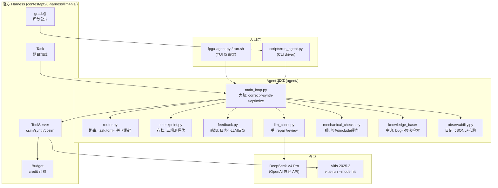

> [English](README.md)

# 项目介绍 (Project Overview)

## 0. 新手阅读地图 (Newcomer Reading Map)

> 如果你第一次接触这个项目，请按下面的路线读。每一步都标注了"读什么文档、学到什么、读完去哪"。不要跳步--后面每一步都建立在前一步的理解上。

| 步骤 | 你在哪 | 读什么 | 学到什么 | 读完去哪 |
|---|---|---|---|---|
| **第0步** | "这项目解决什么问题" | 本文档 §1-§3 | 项目目标和使用场景 | 第1步 |
| **第1步** | "整体怎么搭" | 本文档 §4-§5 + 根 [README.md](../README.cn.md) 的架构图 | 各模块怎么协作、数据怎么流 | 第2步 |
| **第2步** | "怎么跑起来" | [`getting-started.md`](../getting-started.cn.md) | 安装、CLI 用法、输出解读 | 第3步 |
| **第3步** | "选一个深入" | 按角色选一个子系统 README | 该子系统的文件结构、调用链、知识点、构建方法 | 第4步 |
| **第4步** | "能改代码了" | 对应代码目录的 `.doc.md` + 源码注释 | 单个文件/函数级实现细节 | 自由探索 |

> **想看进度和已知问题**：[`engineering-plan`](../docs-development/engineering-plan/engineering-plan.md)（进度）。（技术债清单原在 `internal-notes/tech-debt.md`，已随开源版移除。）
>
> **动手前必读的硬约束**：[`runtime-constraints.md`](../docs-development/runtime-constraints.cn.md)--违反会卡死或返工。

---

## 1. 这个项目是什么 (What is this project)

> **一句话**：Budgeted End-to-End LLM4HLS Agent -- 在有限的工具调用预算内，自动修复并优化 AMD Vitis HLS 的 C/C++ 代码（先修正确性，再优化 PPA）。

本项目是为 FPT'26 Design Competition Track A（LLM4HLS Agent）开发的参赛作品。它是一个自主 AI Agent，接收一道 HLS 题目（含初始 kernel 代码），在 credit 预算内通过调用 csim/synth/cosim 工具获得反馈，借助 LLM（DeepSeek V4 Pro）诊断并修复代码，最终提交功能正确且 PPA 优化的解决方案。

---

## 2. 项目背景与动机 (Background & Motivation)

FPGA 开发的高门槛在于：HLS C/C++ 代码既要保证算法正确性（csim 通过），又要保证硬件可实现性（synth 通过），还要优化性能/面积/功耗（PPA）。传统流程中，工程师需要反复编译、综合、仿真、读报告、改代码，耗时且依赖经验。

FPT'26 Track A 赛题要求开发一个自主 Agent，替代人工完成这一"反馈-修复-优化"循环。AMD 官方的 LLM4HLS SHA-256 案例研究证明 LLM 在 2 周内可实现 2.22x 加速，验证了方法可行性。本项目的目标是构建一个预算受限、correctness 优先、可观测的 Agent，在隐藏测试集上取得尽可能高的 SCORE。

---

## 3. 用户故事 (User Stories)

一位 **Agent 开发者**，需要验证 agent 能否修通一道 HLS 题。他运行 `./run.sh`，在 TUI 选题界面选了 projection_bugfix，TUI 仪表盘实时显示 agent 的思考流、工具调用结果、credit 消耗。agent 自主诊断出 csim runtime_fail，让 DeepSeek 生成修复，机械检查 + LLM review 双层验证后重跑 csim，全过。最后评分卡显示 SCORE 1.400。全程不需要人工干预代码。

---

## 4. 总体架构 (Overall Architecture)

**核心数据流**：`route(task)` 选关卡路径 -> `_reach_correctness()` 在 csim（+cosim）上修复循环 -> `_do_synth()` 拿 baseline latency -> `_optimize()` 冲 PPA（P4）-> 返回 best code -> `grade()` 评分。

**依赖方向**：`main_loop` 依赖所有 agent 模块 + harness。agent 模块之间尽量不互相依赖（checkpoint/router/feedback/observability/knowledge_base 都是独立的）。

---

## 5. 子系统概览 (Subsystem Overview)

| 子系统 | 目录 | 职责 |
|---|---|---|
| **Agent 本体** | `agent/` | 大脑：主循环、路由、存档、反馈、LLM 调用、机械检查、可观测性、知识库 |
| **TUI 仪表盘** | `tui/` | 交互式终端界面：选题 + 四区域仪表盘（流程图/错误栏/活动面板/状态栏） |
| **CLI 入口** | `scripts/` | 命令行 driver（非 TUI 模式），组装 agent 并跑端到端 |
| **官方 Harness** | `contest/fpt26-harness/` | 评估框架：ToolServer/Budget/Task/scoring/CSimTool/SynthTool/CoSimTool（只读复用） |
| **赛题材料** | `contest/` | 赛题规则、提交指南、AMD 案例文章、3 道公开题 |
| **辅助工具** | `tools/` | web_fetch.py（绕过域名验证的网络访问脚本） |
| **运行产物** | `runs/` | agent 运行产物根（已 gitignore） |

---

## 6. 关键术语表 (Glossary)

| 术语 | 英文 | 解释 |
|---|---|---|
| HLS | High-Level Synthesis | 高层次综合。把 C/C++ 翻译成 RTL 电路，本项目用 AMD Vitis HLS |
| csim | C Simulation | 纯软件仿真，g++ 编译 + testbench，验算法逻辑。代价 1 credit |
| synth | Synthesis | 高层次综合，把 C++ 翻译成 RTL，静态分析。代价 4 credit |
| cosim | Co-Simulation | 协同仿真，真模拟电路跑起来，验运行时行为（死锁/时序）。代价 20 credit |
| credit | - | 工具调用预算（硬限制），每题 task.toml 定义。超了 BudgetExceeded 抛异常停 |
| token | - | LLM 调用消耗的字数（软限制），终评重要指标，用得少分高 |
| PPA | Performance, Power, Area | 性能/功耗/面积，优化目标。评分中映射为加速比 |
| ReAct | Reasoning + Acting | Agent 范式：Thought -> Action -> Observation 交替循环 |
| correctness | - | 功能正确性。评分硬门槛：csim 过 + cosim 过（若 requires_cosim），不过直接 0 分 |
| SCORE | - | 评分公式输出：`difficulty * (0.5*correct + 0.2*synth_pass + 0.3*ppa_norm)` |
| checkpoint | - | 存档机制。三规则：等级更高->存 / 同级比 latency->更低才存 / 更低->拒 |
| task_type | - | 题目类型：generate/repair/optimize/structural，决定 bug 藏在哪关 |
| harness | - | 官方评估框架（contest/fpt26-harness/），agent 只读复用其 ToolServer/Budget 等 |
| LLM4HLS | - | 用 LLM 做 HLS 代码生成/修复/优化，本赛题主题 |
