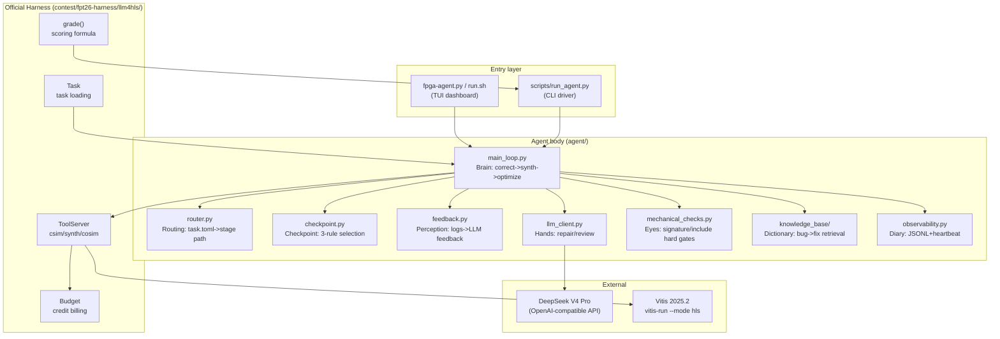

> [中文](README.cn.md)

# Project Overview (项目介绍)

## 0. Newcomer Reading Map (新手阅读地图)

> If this is your first encounter with the project, please read along the route below. Each step is annotated with "what document to read, what you'll learn, where to go next." Don't skip steps -- each later step builds on the understanding of the previous one.

| Step | Where you are | What to read | What you'll learn | Where to go next |
|---|---|---|---|---|
| **Step 0** | "What problem does this project solve" | This doc §1-§3 | Project goals and use cases | Step 1 |
| **Step 1** | "How is it put together overall" | This doc §4-§5 + the architecture diagram in the root [README.md](../README.md) | How the modules cooperate, how data flows | Step 2 |
| **Step 2** | "How to run it" | [`README.md`](../README.md) (Quick Start section) | Installation, CLI usage, output interpretation | Step 3 |
| **Step 3** | "Pick one to go deep" | Pick a subsystem README by role | That subsystem's file structure, call chain, knowledge points, build method | Step 4 |
| **Step 4** | "Able to modify code now" | The `.doc.md` in the corresponding code directory + source comments | Single file/function-level implementation details | Free exploration |

> **Want to see progress and known issues**: [`engineering-plan`](../docs-development/engineering-plan/engineering-plan.md) (progress). (The tech-debt list was originally in `internal-notes/tech-debt.md`, removed with the open-source release.)
>
> **Hard constraints you must read before starting**: `docs-development/runtime-constraints.md` (in the full development repo, not included in this open-source release) -- violating them causes hangs or rework.

---

## 1. What is this project (这个项目是什么)

> **In one sentence**: Budgeted End-to-End LLM4HLS Agent -- within a limited tool-call budget, automatically repairs and optimizes AMD Vitis HLS C/C++ code (first fix correctness, then optimize PPA).

This project is a competition entry developed for FPT'26 Design Competition Track A (LLM4HLS Agent). It is an autonomous AI Agent that receives an HLS task (including the initial kernel code) and, within the credit budget, obtains feedback by calling csim/synth/cosim tools, leverages an LLM (DeepSeek V4 Pro) to diagnose and repair the code, and ultimately submits a functionally correct and PPA-optimized solution.

---

## 2. Background & Motivation (项目背景与动机)

The high barrier to FPGA development lies in the fact that HLS C/C++ code must ensure algorithmic correctness (csim passes), hardware realizability (synth passes), and optimization of performance/area/power (PPA). In the traditional flow, engineers must repeatedly compile, synthesize, simulate, read reports, and modify code -- time-consuming and experience-dependent.

The FPT'26 Track A competition requires developing an autonomous Agent to replace humans in completing this "feedback-repair-optimize" loop. AMD's official LLM4HLS SHA-256 case study demonstrated that an LLM can achieve a 2.22x speedup within 2 weeks, validating the feasibility of the approach. The goal of this project is to build a budget-constrained, correctness-first, observable Agent that achieves as high a SCORE as possible on the hidden test set.

---

## 3. User Stories (用户故事)

An **Agent developer** needs to verify whether the agent can repair a given HLS task. He runs `./run.sh`, selects projection_bugfix on the TUI task-selection screen, and the TUI dashboard shows the agent's thought stream, tool-call results, and credit consumption in real time. The agent autonomously diagnoses a csim runtime_fail, has DeepSeek generate a repair, and after dual-layer verification (mechanical checks + LLM review), reruns csim, which fully passes. Finally, the scorecard shows SCORE 1.400. The whole process requires no manual intervention on the code.

---

## 4. Overall Architecture (总体架构)

**Core data flow**: `route(task)` selects the stage path -> `_reach_correctness()` runs the repair loop on csim (+cosim) -> `_do_synth()` obtains the baseline latency -> `_optimize()` pushes for PPA (P4) -> returns the best code -> `grade()` scores it.

**Dependency direction**: `main_loop` depends on all agent modules + the harness. The agent modules try not to depend on each other (checkpoint/router/feedback/observability/knowledge_base are all independent).

---

## 5. Subsystem Overview (子系统概览)

| Subsystem | Directory | Responsibility |
|---|---|---|
| **Agent body** | `agent/` | The brain: main loop, routing, checkpointing, feedback, LLM calls, mechanical checks, observability, knowledge base |
| **TUI dashboard** | `tui/` | Interactive terminal interface: task selection + four-region dashboard (flow diagram/error bar/activity panel/status bar) |
| **CLI entry** | `scripts/` | Command-line driver (non-TUI mode); assembles the agent and runs end-to-end |
| **Official harness** | `contest/fpt26-harness/` | Evaluation framework: ToolServer/Budget/Task/scoring/CSimTool/SynthTool/CoSimTool (read-only reuse) |
| **Competition materials** | `contest/` | Competition rules, submission guide, AMD case-study article, 3 public tasks |
| **Auxiliary tools** | `tools/` | web_fetch.py (a network-access script that bypasses domain verification) |
| **Run artifacts** | `runs/` | Root for agent run artifacts (gitignored) |

---

## 6. Glossary (关键术语表)

| Term | English | Explanation |
|---|---|---|
| HLS | High-Level Synthesis | High-level synthesis. Translates C/C++ into RTL circuitry; this project uses AMD Vitis HLS |
| csim | C Simulation | Pure software simulation, g++ compile + testbench, verifies algorithm logic. Costs 1 credit |
| synth | Synthesis | High-level synthesis, translates C++ into RTL, static analysis. Costs 4 credit |
| cosim | Co-Simulation | Co-simulation, actually simulates the circuit running, verifies runtime behavior (deadlock/timing). Costs 20 credit |
| credit | - | Tool-call budget (hard limit), defined per task in task.toml. Exceeding it raises BudgetExceeded and stops |
| token | - | Word count consumed by LLM calls (soft limit), an important metric in the final evaluation; less usage means higher score |
| PPA | Performance, Power, Area | Performance/power/area, the optimization target. Mapped to speedup ratio in scoring |
| ReAct | Reasoning + Acting | Agent paradigm: alternating Thought -> Action -> Observation loop |
| correctness | - | Functional correctness. Hard scoring gate: csim passes + cosim passes (if requires_cosim); failing means 0 points directly |
| SCORE | - | Scoring formula output: `difficulty * (0.5*correct + 0.2*synth_pass + 0.3*ppa_norm)` |
| checkpoint | - | Checkpoint mechanism. Three rules: higher level -> save / compare latency at same level -> save only if lower / lower level -> reject |
| task_type | - | Task type: generate/repair/optimize/structural, determines which stage the bug is hidden in |
| harness | - | Official evaluation framework (contest/fpt26-harness/), read-only reuse of its ToolServer/Budget, etc. |
| LLM4HLS | - | Using LLM for HLS code generation/repair/optimization, the theme of this competition |
