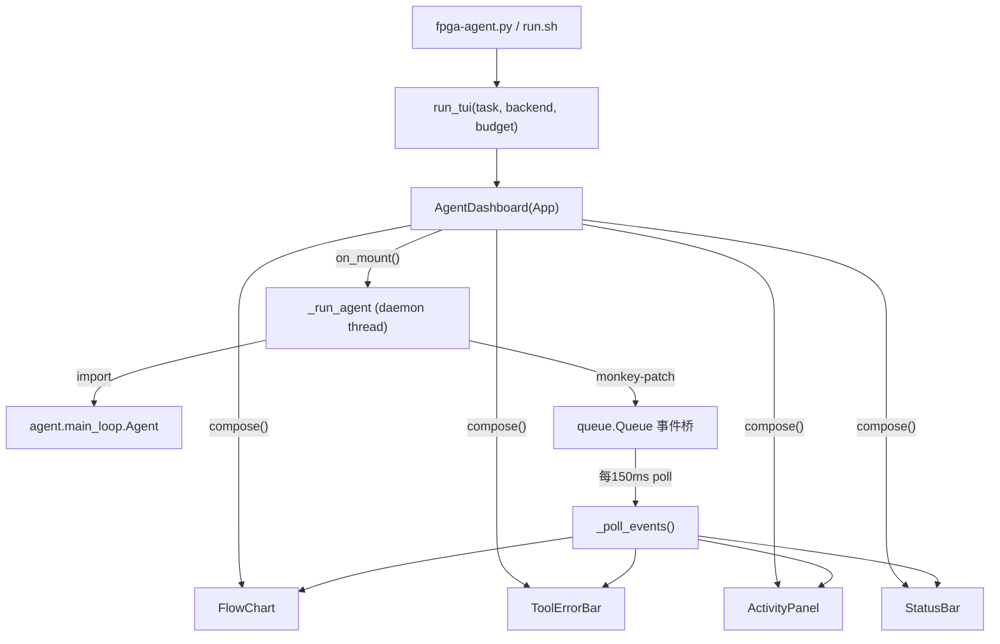

# TUI 仪表盘 (TUI Dashboard)

> Textual + Rich 实现的交互式终端仪表盘，实时展示 agent 运行状态。设计文档见
> [`docs-development/design/tui-design.md`](../docs-development/design/tui-design.md)。

## 文件结构

| 文件 | 职责 |
|---|---|
| `app.py` | `AgentDashboard(App)`：主应用，组装四区域 + 后台线程跑 agent + 事件队列桥接 |
| `flow_chart.py` | `FlowChart(Static)`：Area A，顶部。5 阶段流水线（route->correctness->synth->optimize->submit），状态符号 + 耗时 + 统计 |
| `tool_error_bar.py` | `ToolErrorBar(Static)`：flow chart 与 activity panel 之间的独立区。固定高 7 行，解析 gcc/Vitis/testcase 错误行，工具运行时显示"正在跑... 已耗时 Xs" |
| `activity_panel.py` | `ActivityPanel(Static)`：Area B，中部主体。单一 `RichLog` 流式输出，LLM thinking（dim italic）+ code（cpp 高亮）交织流式，或工具日志 |
| `status_bar.py` | `StatusBar(Static)`：Area C，底部。credit 进度条 + token 统计（含 reasoning）+ 本环节调用次数 + review 意见 |
| `task_picker.py` | `TaskPickerScreen(Screen)` + `scan_tasks(root)`：交互式任务选择屏，扫描 harness `tasks/` 目录，支持自定义路径 |
| `__init__.py` | 包入口，导出 `FlowChart`/`ActivityPanel`/`StatusBar`（原设计三件套） |

## 调用链



**线程模型**：`on_mount()` 起守护线程 `_run_agent()` 跑 agent，主线程每 150ms `_poll_events()` 从 `queue.Queue` 取事件刷新 UI。线程桥接用 monkey-patch 包装 `agent.log.event` 和 `agent.hb.set_stage`，把 agent 内部调用转发成队列事件（`init`/`event`/`stream`/`heartbeat`/`done`/`error`）。

**`__init__.py` 导出说明**：只 re-export 了原设计的三件套（`FlowChart`/`ActivityPanel`/`StatusBar`）。后加的 `ToolErrorBar` 和 `TaskPickerScreen`/`scan_tasks` 走 `app.py` 直接导入，不经 `__init__`。

## 知识点

- **主题配色（v3 起）**：自定义 Textual 主题 `fpga-light`（定义在 `app.py`，规格见设计文档 §3.5）——primary `#587559`（灰绿）、accent/装饰 `#FDD100`（金黄，四区域边框/当前阶段高亮/credit 进度条）、白底黑字，CoT 思维链保持灰色（dim italic）。代码高亮主题用 `github-light`（配合白底）。界面文案全英文。
- **Textual App 生命周期**：`compose()` 布局 -> `on_mount()` 启动后台线程 -> `poll` 刷新 -> `q` 弹 `QuitConfirmScreen` 确认退出。
- **线程桥接**：Textual 是单线程事件循环，agent 跑在子线程。用 `queue.Queue` 做线程安全通信，主线程 poll 取事件后调 widget 方法（widget 方法本身不是线程安全的，必须在主线程调）。
- **RichLog 流式输出**：thinking 逐 token 用 `Static` 覆盖式刷新（dim italic），完整行写入 `RichLog`；code 行缓冲 + cpp 语法高亮（`Syntax` widget）。两者在同一区域连续输出。
- **DeepSeek stream 模式**：`deepseek_client.py` 加 `stream=True` + `on_stream` 回调。`reasoning_content` -> thinking，`content` -> code。

## 构建方法

```bash
# 依赖：textual + rich（需 pip install）
pip install textual rich

# 启动（自动 source Vitis + .env + venv）
./run.sh
./run.sh --task contest/fpt26-harness/tasks/projection_bugfix
./run.sh --backend deepseek   # 真 LLM
```

## 已知坑点

- **两个 App 冲突黑屏**：早期用 Textual 的 `TaskPickerScreen` + `AgentDashboard` 两个 App，切换时黑屏。改为纯 `print+input` 做选题（不用 Textual），只有 `AgentDashboard` 一个 App。
- **widget 方法非线程安全**：agent 子线程不能直接调 widget 方法，必须经 `queue.Queue` 转发到主线程。
- **ToolErrorBar 噪声过滤**：Vitis 日志含大量 INFO/WARNING 行，需过滤只留 error 行，否则 7 行不够用。HLS 错误码（如 `@E`）需排除误报。
- **Header 不显示 name 参数**：`Header(name=...)` 只是 DOM 节点名，标题栏显示的是 `app.title`。版本号要用 `self.title = ...` 设置，否则标题栏只显示类名。
- **关闭时 NoMatches 竞态**：150ms 轮询定时器在关闭卸载 widget 后可能再触发一拍，`query_one` 抛 `NoMatches`。`_poll_events` 已包兜底丢弃该拍（v0.1.1 修复）。
