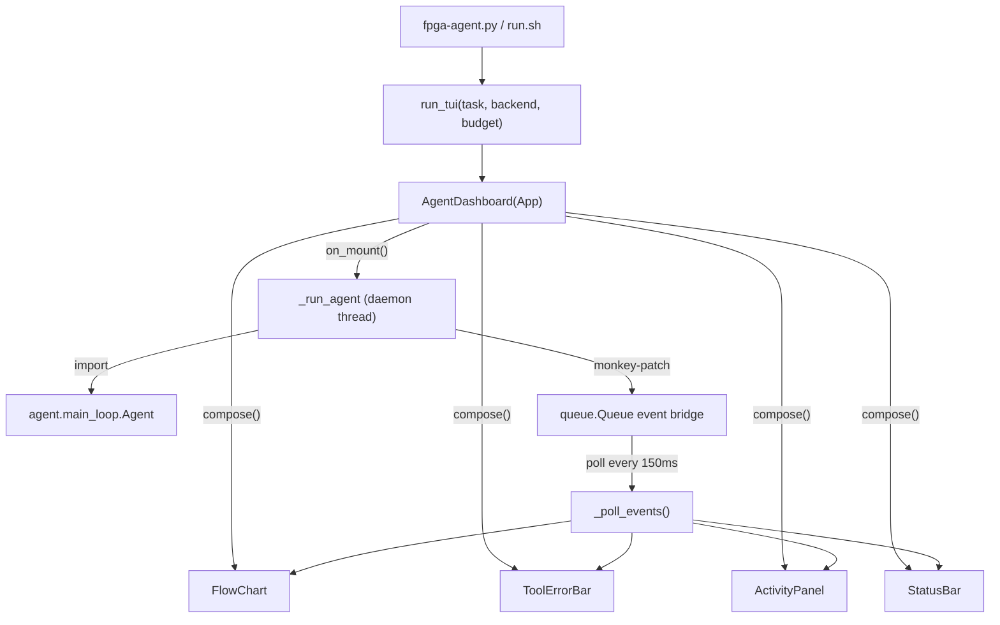

> [中文](README.cn.md)

# TUI Dashboard

> An interactive terminal dashboard built with Textual + Rich that shows the agent's run status in real time. For the design doc, see [`docs-development/design/tui-design.md`](../docs-development/design/tui-design.md).

## File Structure

| File | Responsibility |
|---|---|
| `app.py` | `AgentDashboard(App)`: the main app, assembles the four regions + runs the agent in a background thread + bridges the event queue |
| `flow_chart.py` | `FlowChart(Static)`: Area A, at the top. The 5-stage pipeline (route->correctness->synth->optimize->submit), with status symbols + elapsed time + stats |
| `tool_error_bar.py` | `ToolErrorBar(Static)`: an independent region between the flow chart and the activity panel. Fixed height of 7 lines, parses gcc/Vitis/testcase error lines, and shows "running... elapsed Xs" while a tool is running |
| `activity_panel.py` | `ActivityPanel(Static)`: Area B, the main middle body. A single `RichLog` for streaming output, interleaving LLM thinking (dim italic) + code (cpp highlighting), or tool logs |
| `status_bar.py` | `StatusBar(Static)`: Area C, at the bottom. Credit progress bar + token stats (including reasoning) + call count for the current stage + review opinions |
| `task_picker.py` | `TaskPickerScreen(Screen)` + `scan_tasks(root)`: an interactive task-selection screen that scans the harness `tasks/` directory and supports custom paths |
| `__init__.py` | Package entry, exports `FlowChart`/`ActivityPanel`/`StatusBar` (the original three-piece set) |

## Call Chain



**Threading model**: `on_mount()` starts a daemon thread `_run_agent()` to run the agent, while the main thread calls `_poll_events()` every 150ms to pull events from the `queue.Queue` and refresh the UI. The thread bridge uses monkey-patching to wrap `agent.log.event` and `agent.hb.set_stage`, forwarding the agent's internal calls into queue events (`init`/`event`/`stream`/`heartbeat`/`done`/`error`).

**`__init__.py` export note**: it only re-exports the original three-piece set (`FlowChart`/`ActivityPanel`/`StatusBar`). The later-added `ToolErrorBar` and `TaskPickerScreen`/`scan_tasks` are imported directly via `app.py`, not through `__init__`.

## Knowledge Points

- **Theme/color scheme (from v3)**: a custom Textual theme `fpga-light` (defined in `app.py`, spec in design doc §3.5) -- primary `#587559` (grey-green), accent/decoration `#FDD100` (golden yellow, used for the four-region borders / current-stage highlight / credit progress bar), white background with black text, and the CoT reasoning chain kept grey (dim italic). The code-highlighting theme is `github-light` (to match the white background). All UI copy is in English.
- **Textual App lifecycle**: `compose()` lays out -> `on_mount()` starts the background thread -> `poll` refreshes -> `q` pops a `QuitConfirmScreen` to confirm quitting.
- **Thread bridging**: Textual is a single-threaded event loop, and the agent runs in a sub-thread. A `queue.Queue` is used for thread-safe communication; the main thread polls for events and then calls widget methods (widget methods are not themselves thread-safe and must be called on the main thread).
- **RichLog streaming output**: thinking is refreshed token-by-token with an overwriting `Static` (dim italic), and complete lines are written to the `RichLog`; code lines are buffered + cpp-syntax-highlighted (the `Syntax` widget). Both stream out continuously in the same region.
- **DeepSeek stream mode**: `deepseek_client.py` adds `stream=True` + an `on_stream` callback. `reasoning_content` -> thinking, `content` -> code.

## Build Method

```bash
# Dependencies: textual + rich (pip install required)
pip install textual rich

# Launch (auto sources Vitis + .env + venv)
./run.sh
./run.sh --task contest/fpt26-harness/tasks/projection_bugfix
./run.sh --backend deepseek   # real LLM
```

## Known Pitfalls

- **Two apps conflicting -> black screen**: early on, using Textual's `TaskPickerScreen` + `AgentDashboard` as two apps caused a black screen on switching. Switched to plain `print+input` for task selection (no Textual), leaving only `AgentDashboard` as the single app.
- **Widget methods are not thread-safe**: the agent sub-thread cannot call widget methods directly; they must be forwarded to the main thread via the `queue.Queue`.
- **ToolErrorBar noise filtering**: Vitis logs contain many INFO/WARNING lines; they must be filtered to keep only error lines, otherwise 7 lines isn't enough. HLS error codes (e.g. `@E`) need false-positive exclusion.
- **Header doesn't show the name parameter**: `Header(name=...)` is only the DOM node name; the title bar shows `app.title`. The version number must be set with `self.title = ...`, otherwise the title bar only shows the class name.
- **NoMatches race on close**: the 150ms polling timer can fire one more tick after the widgets have been unloaded on close, and `query_one` raises `NoMatches`. `_poll_events` already wraps this with a fallback that drops that tick (fixed in v0.1.1).
- **Heartbeat overwriting region content**: `_refresh_ui` calls `ToolErrorBar.show_running` every 150ms -- if the bar writes content with a one-shot `update()`, the heartbeat wipes out the other regions (e.g. the v0.3.0 optimize-strategy panel). ToolErrorBar has been changed to **state-driven rendering** (internal region state + `_rebuild()` assembly, v0.3.0): when adding region info, always go through the `show_*` methods to change state; do not call `update()` directly.
- **Custom method names colliding with Textual internals**: in v0.3.0 a combination method was named `_compose()`, colliding with `Widget._compose()` (called by the framework on mount, expected to be a component generator); launching in a real terminal crashed immediately with `TypeError: object Text can't be used in 'await' expression` (fixed to `_build_render` in v0.3.1). When adding methods to widgets, avoid framework-reserved names like `compose`/`_compose`/`render`/`_render`; **any TUI change must pass a real-mount smoke test via `run_test()` once** -- testing only the combination method is not enough.
